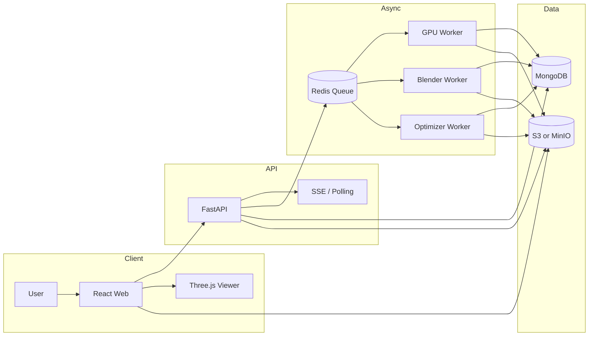
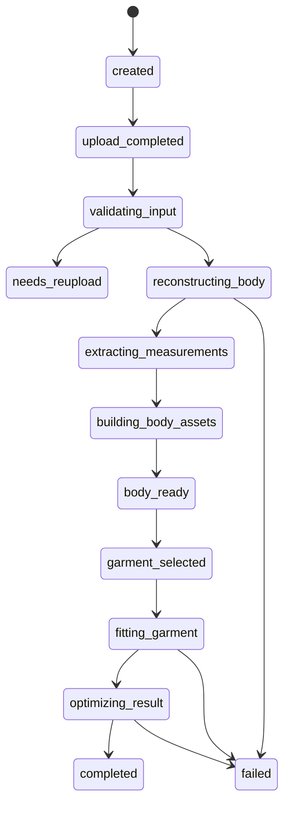

# Capstone 3D Virtual Fitting Platform

단일 전신 사진 기반 `canonical body reconstruction`과 `3D garment fitting` 중심의 body-only virtual fitting 저장소

현재는 전체 프로젝트 monorepo 기준 저장소  
임시 전체 프로젝트 monorepo 운영 상태

상세 설계 문서: [plan.md](./plan.md)  
실행 단계 문서: [step.md](./step.md)

## Table of Contents

- [1. Project Definition](#1-project-definition)
- [2. Current Repository Status](#2-current-repository-status)
- [3. Scope](#3-scope)
- [4. Architecture](#4-architecture)
- [5. Job Flow](#5-job-flow)
- [6. Repository Structure](#6-repository-structure)
- [7. Domain Docs](#7-domain-docs)
- [8. Current Implementation Snapshot](#8-current-implementation-snapshot)
- [9. Recommended Next Steps](#9-recommended-next-steps)
- [10. Core Risks](#10-core-risks)

## 1. Project Definition

### Goal

사용자 전신 사진 1장 업로드 후, `SAM 3D Body`로 canonical body를 복원하고, 준비된 3D garment asset을 body 위에 fitting한 뒤, 최종 `.glb`를 브라우저에서 360도로 확인할 수 있는 시스템 목표

### Core Value

- 평균 마네킹이 아닌 사용자 body silhouette 기준 결과 확인 가능성
- garment category별 fit visual 확인 가능성
- web 기반 end-to-end demo 가능성
- body / garment / fitting / viewer를 분리한 확장 구조 확보

### Product Position

이 저장소의 방향은 `digital human generator`가 아니라 `body-based virtual fitting platform`이다.

즉:

- 중심 산출물: canonical body
- 중심 과제: garment fitting
- 비중 낮은 영역: 얼굴 개인화

## 2. Current Repository Status

현재 상태는 설계와 구현이 혼합된 초기 MVP 단계다.

완료 범위:

- AI body reconstruction CLI
- `SAM 3D Body` real inference smoke test
- benchmark / dataset / artifact spec 문서
- FastAPI skeleton
- React + Three.js OBJ viewer
- local Redis / Mongo / MinIO compose baseline

미완료 범위:

- canonical measurement 고도화
- Blender garment fitting worker 본 구현
- 결과 `.glb` 최적화 pipeline
- API와 worker의 full orchestration
- 업로드부터 결과 viewer까지의 complete web flow

## 3. Scope

### MVP Scope

- 입력: 정면 전신 사진 1장
- 대상: 성인 1명
- 지원 garment category: `top`, `bottom`, `outer`, `dress`
- 출력: `body + garment` 결과 `.glb`
- latency 목표: 20~60초

### Out of Scope

- 얼굴, 머리카락, 손가락 고정밀 복원
- 실시간 webcam fitting
- multi-person input
- arbitrary 2D clothing image to 3D garment conversion
- exact size recommendation guarantee

## 4. Architecture



레이어별 역할:

- Frontend: upload, status, garment selection, 3D viewer
- Backend API: job orchestration, metadata, storage URL 발급
- GPU Worker: body reconstruction, measurement extraction
- Blender Worker: garment fitting
- Optimizer Worker: delivery artifact 생성

## 5. Job Flow



핵심 원칙:

- `body_ready` 이전 garment fitting 시작 금지
- 모든 long-running 작업은 queue 기반 처리
- intermediate artifact 저장 우선

## 6. Repository Structure

```text
/frontend
  /web
  /docs
/backend
  /api
  /docs
/ai
  /workers
  /docs
  /scripts
  /third_party
  /checkpoints
/assets
  /garments
  /hdri
/infra
  /docker
  /nginx
  /monitoring
/packages
  /shared-config
  /shared-types
/plan.md
/step.md
```

## 7. Domain Docs

- 전체 설계: [plan.md](./plan.md)
- 실행 단계: [step.md](./step.md)
- 발표용 요약: [plan.docs](./plan.docs)
- frontend 상세: [frontend/docs/README.md](./frontend/docs/README.md)
- backend 상세: [backend/docs/README.md](./backend/docs/README.md)
- AI / asset / benchmark: [ai/docs](./ai/docs)

## 8. Current Implementation Snapshot

### Frontend

- React / Vite shell 준비 상태
- OBJ viewer 구현 상태
- mesh orbit / zoom / pan 가능 상태
- result page는 아직 raw OBJ viewer 수준

주요 경로:

- [frontend/web/src/pages/ObjViewerPage.tsx](./frontend/web/src/pages/ObjViewerPage.tsx)
- [frontend/web/src/viewer/ObjViewerCanvas.tsx](./frontend/web/src/viewer/ObjViewerCanvas.tsx)

### Backend

- FastAPI skeleton 준비 상태
- `/v1/health` 기준 healthcheck 가능 상태
- full API contract 및 queue orchestration은 설계 단계

주요 경로:

- [backend/api/app/main.py](./backend/api/app/main.py)
- [backend/api/app/api/v1/health.py](./backend/api/app/api/v1/health.py)

### AI

- GPU worker CLI 준비 상태
- mock provider + real `SAM 3D Body` provider 연동 상태
- body reconstruction smoke test 완료 상태
- body-only artifact 생성 상태

주요 경로:

- [ai/workers/gpu-worker/app/cli.py](./ai/workers/gpu-worker/app/cli.py)
- [ai/workers/gpu-worker/app/pipelines/reconstruction.py](./ai/workers/gpu-worker/app/pipelines/reconstruction.py)
- [ai/workers/gpu-worker/app/providers/sam3d.py](./ai/workers/gpu-worker/app/providers/sam3d.py)

## 9. Recommended Next Steps

1. Step 4 진행: canonical body measurement 고도화
2. Step 5 진행: garment asset 1종 정규화
3. Step 6 진행: Blender fast fit PoC
4. Step 7 진행: OBJ -> GLB delivery path 정리
5. Step 8 이후: API / queue / upload UI 통합

## 10. Core Risks

- 단일 사진 기반 body proportion 오차
- garment asset 품질 편차
- fitting collision과 penetration
- body reconstruction 결과와 garment metadata의 좌표계 불일치
- frontend / backend / worker contract drift

현재 방향의 핵심은 얼굴 복원이 아니라 `body reconstruction + garment fitting`이다.  
git 업로드와 이후 구현 기준도 이 원칙을 기준으로 유지 필요
