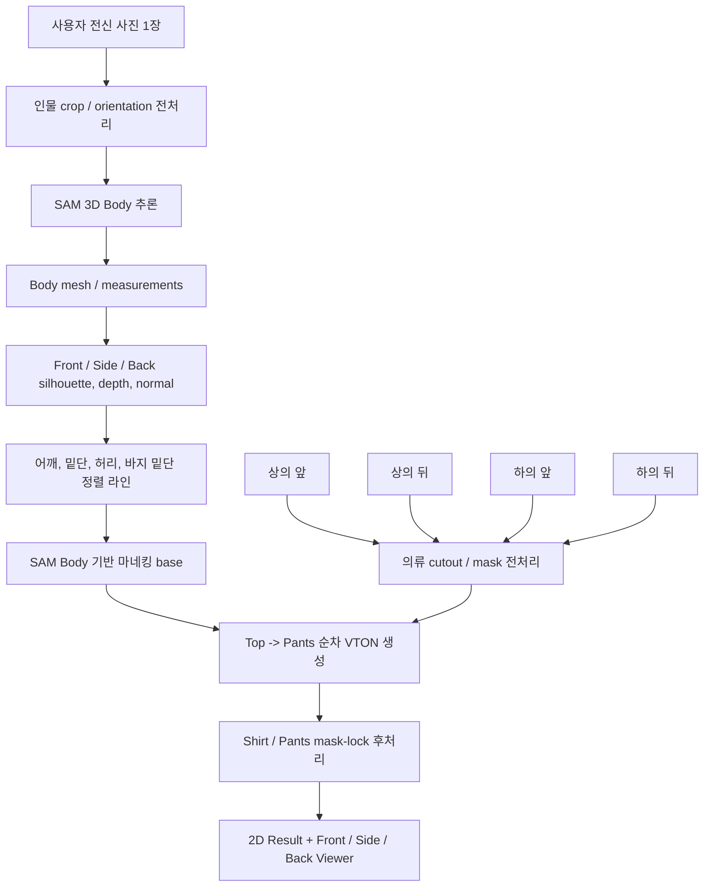

# Virtual Fitting Studio

SAM 3D Body 기반 가상 피팅 캡스톤 데모입니다. 사용자의 전신 사진 1장과 상의 앞/뒤, 하의 앞/뒤 이미지를 입력받고, SAM으로 추정한 신체 비율과 가이드맵을 기반으로 2D 피팅 결과와 front / side / back 2.5D 마네킹 뷰어를 제공합니다.

## 주요 기능

- 전신 사진, 상의 앞/뒤, 하의 앞/뒤 총 5장 업로드
- 업로드 후 `Run Fitting`으로 피팅 플로우 실행
- 2D 가상 피팅 결과 확인
- `3D Viewer`에서 front / side / back 마네킹 피팅 결과 전환
- `Analytics` 화면에서 SAM Body, guide map, 최종 결과 흐름 확인

## 파이프라인 접근 방식

이 프로젝트는 완전한 3D 의상 시뮬레이션 대신, SAM 3D Body로 사용자의 신체 비율을 고정하고 각 뷰의 2D 생성 결과를 정렬하는 2.5D 가상 피팅 구조를 사용합니다. 핵심 목표는 발표 환경에서 front / side / back 결과가 같은 체형과 같은 의상 기준선을 공유하도록 만드는 것입니다.


```mermaid
flowchart TD
  Person[사용자 전신 사진 1장]
  TopF[상의 앞]
  TopB[상의 뒤]
  PantsF[하의 앞]
  PantsB[하의 뒤]

  Person --> Preprocess[인물 crop / orientation 전처리]
  Preprocess --> SAM[SAM 3D Body 추론]
  SAM --> Mesh[Body mesh / measurements]
  Mesh --> Guides[Front / Side / Back silhouette, depth, normal]
  Guides --> Lines[어깨, 밑단, 허리, 바지 밑단 정렬 라인]
  Lines --> Base[SAM Body 기반 마네킹 base]

  TopF --> Garments[의류 cutout / mask 전처리]
  TopB --> Garments
  PantsF --> Garments
  PantsB --> Garments

  Base --> VTON[Top -> Pants 순차 VTON 생성]
  Garments --> VTON
  VTON --> Lock[Shirt / Pants mask-lock 후처리]
  Lock --> Display[2D Result + Front / Side / Back Viewer]
```

### 핵심 아이디어

1. **SAM 3D Body로 체형 기준 고정**
   - 입력 사진에서 body mesh와 신체 측정값을 추출합니다.
   - 이 측정값으로 front / side / back 마네킹 base를 만들기 때문에 뷰마다 체형이 흔들리지 않도록 합니다.

2. **Guide map과 정렬 라인으로 뷰 간 위치 일관성 확보**
   - silhouette, depth, normal map으로 인체 윤곽과 방향을 기록합니다.
   - Analytics에는 어깨선, 상의 밑단, 허리선, 바지 밑단 기준선을 front / side / back에 표시해 의상이 같은 위치에 놓였는지 확인할 수 있게 했습니다.

3. **VTON 생성 후 mask-lock으로 마무리**
   - 상의와 하의를 순차적으로 입힌 후보 이미지를 생성합니다.
   - 최종 단계에서는 shirt / pants mask 영역만 의류 결과를 적용하고, 나머지 신체 영역은 SAM Body 기반 마네킹을 유지합니다.

## 실행 방법

### 1. 의존성 설치

```bash
python -m venv .venv
source .venv/bin/activate
python -m pip install -r requirements.txt
```

이미 `conda` 환경을 쓰는 경우에는 가상환경 생성 없이 해당 환경에서 설치해도 됩니다.

```bash
conda activate bys
python -m pip install -r requirements.txt
```

### 2. 웹 UI 실행

```bash
python scripts/dev/run_server.py --port 8000
```

브라우저에서 아래 주소를 엽니다.

```text
http://127.0.0.1:8000
```

### 3. GPU 파이프라인 실행

GPU에서 실제 생성 단계를 실행하려면 `.env`를 준비합니다.

```bash
cp .env.example .env
```

`.env` 예시:

```env
HF_TOKEN=
FASHN_API_KEY=
CONDA_ENV=bys
SAM3D_BODY_DIR=external/sam-3d-body
FASHN_WEIGHTS_DIR=external/fashn-vton-1.5/weights
```

SAM 3D Body 공식 소스는 아래처럼 연결합니다.

```bash
git clone https://github.com/facebookresearch/sam-3d-body.git external/sam-3d-body
```

주요 생성 단계:

```bash
python scripts/18_build_sam_body_only_mannequin_base.py
python scripts/19_generate_sam_body_only_fashn_viewer.py --views front back side --seeds 2101 2201
python scripts/20_select_sam_body_only_viewer.py
python scripts/10_guard_viewer_contract.py
```

웹 UI에서는 실행 모드를 `GPU`로 선택한 뒤 `Run Fitting`을 누르면 백엔드가 설정된 파이프라인 단계를 순서대로 실행합니다.

### 4. 발표용 UI 확인 흐름

1. 웹 UI를 실행합니다.
2. 왼쪽 슬롯에 사용자 사진, 상의 앞/뒤, 하의 앞/뒤 총 5장을 업로드합니다.
3. `Run Fitting`을 눌러 결과 화면으로 이동합니다.
4. `3D Viewer`에서 `Front`, `Side`, `Back` 탭을 전환합니다.
5. `Analytics`에서 SAM Body guide map과 front / side / back 정렬 라인을 확인합니다.

## 검증 방법

```bash
make check
```

conda 환경을 지정해서 실행하려면:

```bash
make check PYTHON="conda run -n bys python"
```

검증 항목:

- 프론트엔드/백엔드 필수 파일 존재 여부
- 결과 이미지 dimension 확인
- `assets/manifest.json` 경로 무결성 확인
- viewer 결과 contract 확인
- 공개 파일 내 비밀값 포함 여부 확인

## 문서

- [개발자 가이드](docs/developer-guide.md)
- [기술 파이프라인](docs/technical-pipeline.md)
- [모델 노트](docs/model-cards-used.md)
- [코드 리뷰 노트](docs/code-review.md)

## 라이선스

MIT License
