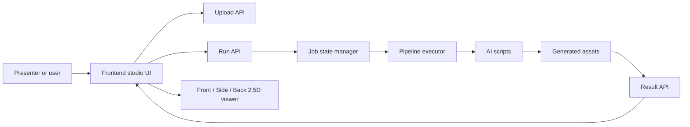
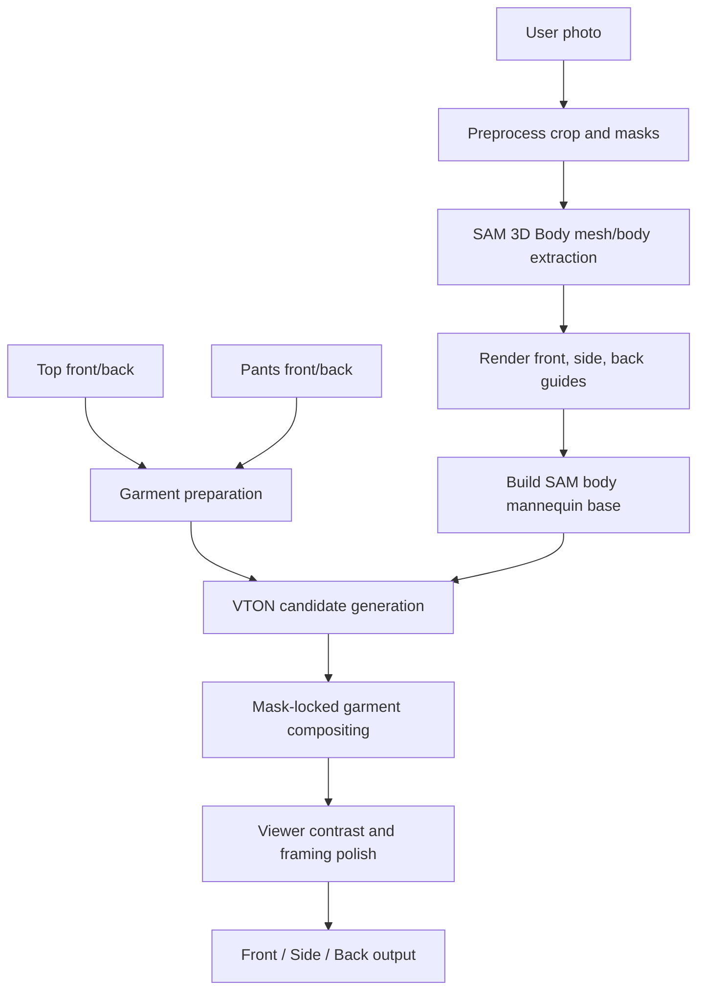
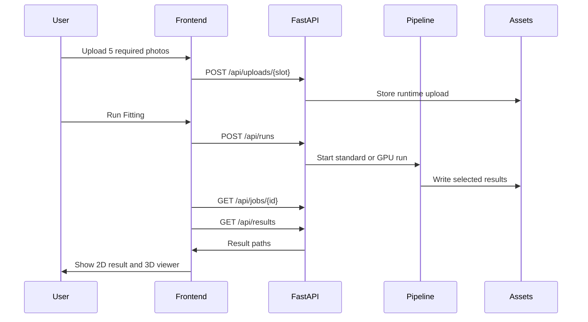

# Virtual Fitting Studio

SAM 3D Body guided virtual fitting demo for a capstone project. The service takes one full-body user photo plus top and pants front/back images, runs a SAM-guided fitting pipeline, and shows a 2.5D viewer with front, side, and back mannequin views.

The public implementation is organized around the current demo target:

- `frontend/`: production-style studio UI for upload, run, and front/side/back viewer inspection.
- `backend/app/`: FastAPI service for uploads, run orchestration, job state, result discovery, and static asset delivery.
- `scripts/`: AI pipeline scripts for preprocessing, SAM 3D Body execution, guide rendering, VTON generation, mask-locked finalization, and artifact checks.
- `assets/`: selected generated outputs and proof images used by the app.
- `docs/`: architecture, pipeline, model notes, and review notes.

License: MIT.

## Quick Start

```bash
python -m venv .venv
source .venv/bin/activate
python -m pip install -r requirements.txt
python scripts/dev/run_server.py --port 8000
```

Open `http://127.0.0.1:8000`.

For GPU generation, set the required model/API credentials in `.env` and run the GPU mode from the UI or command line:

```bash
git clone https://github.com/facebookresearch/sam-3d-body.git external/sam-3d-body
python scripts/18_build_sam_body_only_mannequin_base.py
python scripts/19_generate_sam_body_only_fashn_viewer.py --views front back side --seeds 2101 2201
python scripts/20_select_sam_body_only_viewer.py
python scripts/10_guard_viewer_contract.py
```

## System Architecture


```mermaid
flowchart LR
  User[Presenter or user] --> UI[Frontend studio UI]
  UI --> Uploads[Upload API]
  UI --> Runs[Run API]
  Runs --> JobState[Job state manager]
  JobState --> Pipeline[Pipeline executor]
  Pipeline --> Scripts[AI scripts]
  Scripts --> Assets[Generated assets]
  Assets --> Results[Result API]
  Results --> UI
  UI --> Viewer[Front / Side / Back 2.5D viewer]
```

## AI Pipeline


```mermaid
flowchart TD
  A[User photo] --> B[Preprocess crop and masks]
  C[Top front/back] --> D[Garment preparation]
  E[Pants front/back] --> D
  B --> F[SAM 3D Body mesh/body extraction]
  F --> G[Render front, side, back guides]
  G --> H[Build SAM body mannequin base]
  D --> I[VTON candidate generation]
  H --> I
  I --> J[Mask-locked garment compositing]
  J --> K[Viewer contrast and framing polish]
  K --> L[Front / Side / Back output]
```

## Runtime Sequence


```mermaid
sequenceDiagram
  participant U as User
  participant F as Frontend
  participant B as FastAPI
  participant P as Pipeline
  participant A as Assets

  U->>F: Upload 5 required photos
  F->>B: POST /api/uploads/{slot}
  B->>A: Store runtime upload
  U->>F: Run Fitting
  F->>B: POST /api/runs
  B->>P: Start standard or GPU run
  P->>A: Write selected results
  F->>B: GET /api/jobs/{id}
  F->>B: GET /api/results
  B->>F: Result paths
  F->>U: Show 2D result and 3D viewer
```

## Result Contract

The viewer contract is intentionally simple and presentation-safe:

- `/assets/results/tryon-2d.png`
- `/assets/results/display/sam-body-only-front-contrast.png`
- `/assets/results/display/sam-body-only-side-contrast.png`
- `/assets/results/display/sam-body-only-back-contrast.png`

Run:

```bash
python scripts/check_artifacts.py
python scripts/check_manifest_paths.py
python scripts/check_token_leaks.py
```

## Documentation

- [Architecture](docs/architecture.md)
- [Technical Pipeline](docs/technical-pipeline.md)
- [Model Notes](docs/model-cards-used.md)
- [Code Review Notes](docs/code-review.md)
