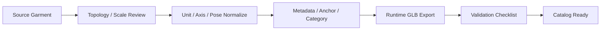

# Garment Asset Spec

기준 문서: [../../../plan.md](../../../plan.md), [../../../step.md](../../../step.md)  
적용 단계: Step 1, Step 5, Step 6  
주요 소비 주체: 3D 팀, Blender worker, backend metadata layer

## 1. 문서 목적

### 핵심 목적

- garment 자산의 제작 기준 통일
- runtime fitting 가능한 asset 조건 명시
- source asset과 runtime asset의 역할 분리
- backend metadata 입력 기준 제공

### 적용 범위

- sample garment 1~3종 준비 단계
- 이후 catalog 확장 단계
- Blender fast fit 및 high quality fit 입력 자산

## 2. 자산 정책 개요

### 자산 구분

| 구분 | 역할 | 권장 포맷 |
|---|---|---|
| Source Asset | 수정 가능한 원본 자산 | `CLO`, `MD`, `FBX`, `BLEND` |
| Runtime Asset | fitting 및 viewer 입력 자산 | `GLB` |
| Preview Asset | 썸네일 또는 관리자 검수용 | `JPG`, `PNG` |
| Metadata | fitting 규칙과 분류 정보 | `JSON` 또는 DB document |

### 권장 원칙

- source와 runtime 분리
- runtime asset의 lightweight 유지
- 모든 garment의 공통 좌표계 사용
- metadata 없는 garment의 catalog 등록 금지

## 3. 지원 카테고리

### 초기 지원 카테고리

- `top`
- `bottom`
- `outer`
- `dress`

### 후순위 카테고리

- `set`
- `shoes`
- `accessory`

### 카테고리별 최소 목표

| category | 초기 목적 |
|---|---|
| `top` | fast fit 기준선 확보 |
| `bottom` | hip / inseam 기준 fitting 검증 |
| `outer` | layering allowance 검증 |
| `dress` | upper + lower combined rule 검증 |

## 4. 자산 파이프라인



## 5. 좌표계 / 단위 / 포즈 기준

### 단위 기준

- 단위: `meter`
- 밀리미터 기반 제작 자산의 runtime export 시 meter 변환 필수

### 좌표계 기준

- front 방향 통일
- up axis 통일
- body canonical pose와 동일 기준 사용

### 포즈 기준

- 기본 pose: canonical body와 동일한 `A-pose` 또는 `T-pose`
- 초기 권장: `A-pose`
- 모든 garment의 runtime export 시 동일 pose 기준 고정

### 원점 기준

- garment root origin의 일관성 중요
- body 기준 pelvis 중심에 상대 배치 가능 구조 필요

## 6. 파일 구조 기준

### 권장 디렉터리 구조

```text
assets/garments/{garmentId}/
├── source/
│   ├── garment_source.fbx
│   ├── garment_source.blend
│   └── notes.md
├── runtime/
│   ├── garment_runtime.glb
│   └── thumbnail.jpg
└── metadata/
    └── garment.json
```

### 파일명 규칙

- 공백 지양
- 소문자 + 하이픈 또는 언더스코어 권장
- category와 size를 metadata로 관리
- 파일명에 비즈니스 의미 과다 부여 지양

## 7. Geometry 기준

### 기본 조건

- non-manifold 과다 지양
- 뒤집힌 normal 제거
- 불필요 hidden mesh 제거
- 중복 mesh 제거
- runtime 기준 너무 높은 poly count 지양

### 토폴로지 권장

- 카테고리별 fitting deformation에 무리 없는 edge flow
- 과도한 triangulation 지양
- 최종 export 직전 triangulation 여부는 exporter 정책에 맞춤

### 분리 기준

- body와 직접 결합되는 garment part 분리 유지 권장
- 장식 mesh는 필요 시 별도 submesh 유지
- material slot 기준의 과다 분할 지양

### 목표 특성

- fast fit 시 심한 찌그러짐 최소화
- shrinkwrap 또는 projection 적용 시 안정적 변형
- collision correction 시 국소 밀집 mesh 과다 현상 방지

## 8. UV / Material / Texture 기준

### UV 기준

- UV 누락 금지
- 겹침 관리 필요
- runtime texture 샘플링 시 artifact 최소화

### PBR 기준

기본 권장 맵:

- base color / albedo
- normal
- roughness
- metallic 필요 시
- opacity 필요 시

### Material 기준

- material slot naming 일관성
- 불필요 material slot 제거
- 의류 본체와 금속 장식 등 물성 차이 분리 가능

### Texture 규격 권장

| 항목 | 권장 |
|---|---|
| 색상 텍스처 | PNG 또는 JPG |
| normal | PNG |
| 해상도 | 1K 또는 2K 시작 |
| runtime 압축 | 추후 KTX2 고려 |

## 9. Rigging / Anchor 기준

### 선택 기준

- skeleton 기반
- anchor point 기반
- 혼합 기반

초기 권장:

- skeleton 완전 의존보다 anchor + transform 규칙 중심
- garment 유형에 따라 최소 anchor set 필수

### 공통 anchor 후보

- `neck`
- `chest_center`
- `spine_upper`
- `spine_lower`
- `hip_center`
- `left_shoulder`
- `right_shoulder`
- `left_armpit`
- `right_armpit`
- `left_waist`
- `right_waist`
- `left_hip`
- `right_hip`

### 카테고리별 최소 anchor

| category | 최소 anchor |
|---|---|
| `top` | `neck`, `left_shoulder`, `right_shoulder`, `chest_center`, `spine_lower` |
| `bottom` | `hip_center`, `left_waist`, `right_waist`, `left_hip`, `right_hip` |
| `outer` | `neck`, `left_shoulder`, `right_shoulder`, `chest_center`, `hip_center` |
| `dress` | `neck`, `left_shoulder`, `right_shoulder`, `chest_center`, `hip_center`, `left_hip`, `right_hip` |

## 10. Size 기준

### base size 의미

- garment가 실제로 authoring된 기준 사이즈
- fitting rule이 비교하는 reference point

### size metadata 필수 항목

- `base_size`
- `supported_sizes`
- `chest_cm` 또는 equivalent
- `waist_cm`
- `hip_cm`
- `shoulder_cm`
- `length_cm`
- 카테고리별 필수 치수

### 카테고리별 필수 치수

| category | 필수 치수 |
|---|---|
| `top` | shoulder, chest, sleeve_length, garment_length |
| `bottom` | waist, hip, thigh, inseam, garment_length |
| `outer` | shoulder, chest, sleeve_length, garment_length |
| `dress` | shoulder, chest, waist, hip, total_length |

## 11. Metadata 스키마

### 필수 필드

```json
{
  "garment_id": "garment_001",
  "name": "Basic Jacket",
  "category": "outer",
  "status": "ready",
  "base_size": "M",
  "supported_sizes": ["S", "M", "L"],
  "gender_profile": "unisex",
  "asset_keys": {
    "source_fbx": "garments/garment_001/source/source.fbx",
    "runtime_glb": "garments/garment_001/runtime/garment_runtime.glb",
    "thumbnail": "garments/garment_001/runtime/thumbnail.jpg"
  },
  "fit_profile": {
    "supports_fast_fit": true,
    "supports_cloth_sim": false,
    "collision_margin_mm": 4,
    "layering_allowance_mm": 6,
    "anchor_points": [
      "neck",
      "left_shoulder",
      "right_shoulder",
      "chest_center",
      "hip_center"
    ]
  },
  "material_profiles": {
    "fabric_type": "cotton",
    "roughness_default": 0.82,
    "normal_strength": 0.6
  },
  "size_measurements": {
    "shoulder_cm": 46,
    "chest_cm": 102,
    "waist_cm": 96,
    "sleeve_cm": 61,
    "length_cm": 68
  }
}
```

### 선택 필드

- `brand`
- `season`
- `colorway`
- `style_tags`
- `designer_notes`
- `validation_report`
- `lod_variants`

## 12. Validation 체크리스트

### 필수 통과 항목

- category 지정 완료
- base size 지정 완료
- runtime glb export 가능
- UV 존재
- material 연결 존재
- anchor 또는 rig 정보 존재
- object scale 정상
- front 방향 정상
- body canonical pose 기준 정렬 가능

### 실패 처리 기준

- UV 없음: fail
- runtime glb 없음: fail
- category 없음: fail
- scale mismatch 심각: fail
- material 연결 없음: warning 또는 fail
- texture 누락: warning

## 13. Step 1 완료 기준

### 완료 조건

- garment spec 문서 확정
- category별 최소 metadata 확정
- runtime 포맷 `GLB` 확정
- source/runtime 분리 정책 확정
- sample garment 준비를 위한 체크리스트 확정

### Step 5로 넘길 입력

- garment asset spec 문서
- metadata JSON 예시
- validation checklist
- category별 anchor 기준

## 14. Step 5에서 실제 준비할 것

### 샘플 자산 최소 구성

- `top` 1종
- `bottom` 1종
- `outer` 또는 `dress` 1종

### 준비 우선순위

1. 상의
2. 하의
3. 아우터 또는 원피스

## 15. 오픈 이슈

### 기술 이슈

- skeleton 기반과 anchor 기반의 최종 우선순위
- cloth sim 지원 garment의 별도 규격 필요성
- runtime LOD의 초기 포함 필요성

### 운영 이슈

- source asset 저장 위치
- thumbnail 생성 자동화 주체
- garment validation 자동화 도구 필요성
