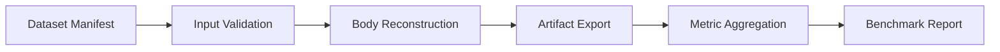

# Reconstruction Benchmark Template

기준 문서: [../../../plan.md](../../../plan.md), [../../../README.md](../../../README.md), [../../../step.md](../../../step.md)  
적용 단계: Step 2, Step 3, Step 4, Step 13  
주요 소비 주체: AI 팀, backend worker 팀, QA

## 1. 사용 목적

- Step 3 reconstruction 실행 결과의 표준 보고 형식
- baseline 수치 고정
- 회귀 비교 기준점 제공

## 2. 보고서 메타데이터

| 항목 | 값 |
|---|---|
| benchmark id | `recon_bench_2026-03-23_a` |
| dataset version | `input-benchmark-v0.1` |
| manifest path | `dataset/input-benchmark/manifest.csv` |
| model version | `sam3d-body-v1` |
| pose model version | `pose-estimator-v2` |
| environment | `conda:bys` |
| GPU | `RTX 3090 24GB` |
| batch size | `1` |
| input resize policy | `max_side=1536` |
| execution mode | `single-run` |

## 3. benchmark 흐름

## 4. 집계 요약 표

| 항목 | 값 |
|---|---|
| total samples | 0 |
| `good` samples | 0 |
| `warning` samples | 0 |
| `reject` samples | 0 |
| validation pass rate | 0.0 |
| validation reject rate | 0.0 |
| reconstruction success rate | 0.0 |
| avg end-to-end latency ms | 0 |
| p50 latency ms | 0 |
| p95 latency ms | 0 |
| avg peak VRAM MB | 0 |

## 5. 라벨별 결과 표

| split | count | validation pass | reconstruction success | avg latency ms | avg peak VRAM MB | notes |
|---|---|---|---|---|---|---|
| `good` | 0 | 0 | 0 | 0 | 0 | |
| `warning` | 0 | 0 | 0 | 0 | 0 | |
| `reject` | 0 | 0 | 0 | 0 | 0 | |

## 6. failure breakdown

| category | count | note |
|---|---|---|
| `needs_reupload` | 0 | |
| `OOM` | 0 | |
| `SEGMENTATION_FAIL` | 0 | |
| `POSE_FAIL` | 0 | |
| `RECON_FAIL` | 0 | |
| `EXPORT_FAIL` | 0 | |

## 7. quality score 요약

| metric | avg | p50 | p95 | note |
|---|---|---|---|---|
| segmentation score | 0 | 0 | 0 | |
| pose confidence | 0 | 0 | 0 | |
| reconstruction score | 0 | 0 | 0 | |
| measurement reliability | 0 | 0 | 0 | |

## 8. 정성 평가 메모

### 잘 나온 사례

- sample id:
- 관찰 포인트:

### 불안정 사례

- sample id:
- 관찰 포인트:

### reject 판정 적절성

- false reject 의심 사례:
- false pass 의심 사례:

## 9. 후속 액션

### 즉시 액션

- 입력 validation threshold 조정 필요 여부
- preprocessing 강화 필요 여부
- 해상도 정책 조정 필요 여부
- 모델 교체 또는 fallback 필요 여부

### 추후 액션

- warning 사례 추가 확보
- low-light 사례 보강
- loose clothing 사례 보강
- 반복 실행 재현성 측정

## 10. 첨부 파일

- run log path:
- metrics csv path:
- sample preview path:
- artifact summary path:

## 11. 연결 문서

- [../datasets/input-benchmark-spec.md](../datasets/input-benchmark-spec.md)
- [../datasets/input-labeling-guide.md](../datasets/input-labeling-guide.md)
- [templates/reconstruction-run-template.csv](./templates/reconstruction-run-template.csv)
