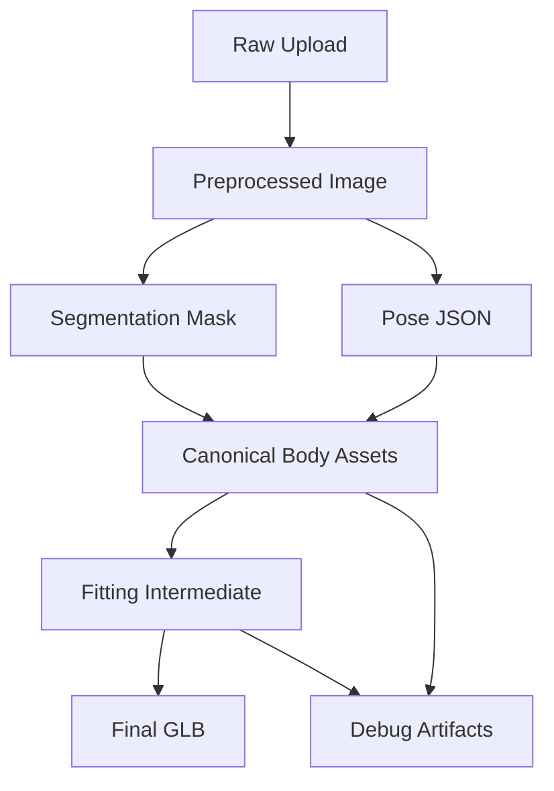

# Artifact Lifecycle Draft

기준 문서: [../../../plan.md](../../../plan.md), [../../../step.md](../../../step.md)  
적용 단계: Step 1, Step 9, Step 13

## 1. 문서 목적

### 핵심 목적

- 각 단계에서 생성되는 artifact 목록 정리
- artifact 간 선후관계 정리
- 보존 정책 초안 정리
- cleanup 기준 초안 정리

## 2. Artifact 분류

### 분류 기준

| 분류 | 의미 |
|---|---|
| Raw | 사용자 원본 입력 |
| Processed | 전처리 및 추론 중간 산출물 |
| Canonical | fitting 기준 body 산출물 |
| Runtime | fitting 및 viewer 전달 산출물 |
| Debug | 운영자 디버깅용 산출물 |

## 3. 생성 흐름

## 4. 단계별 Artifact 목록

### 업로드 단계

- original photo

### 전처리 단계

- normalized image
- cropped preview

### AI 단계

- person mask
- keypoints json
- body params
- canonical body mesh
- body preview glb
- texture maps
- quality score json

### fitting 단계

- fitted intermediate glb
- optional `.blend` debug file
- collision report

### optimization 단계

- final glb
- thumbnail
- optional optimized texture pack

## 5. Artifact 테이블

| artifact | 생성 주체 | 소비 주체 | 보존 우선순위 |
|---|---|---|---|
| raw image | client | GPU worker | 낮음 |
| normalized image | GPU worker | GPU worker | 중간 |
| person mask | GPU worker | GPU worker | 중간 |
| keypoints json | GPU worker | GPU/Blender | 중간 |
| canonical body mesh | GPU worker | Blender worker | 높음 |
| preview body glb | GPU worker | frontend/admin | 중간 |
| texture maps | GPU worker | Blender/result pipeline | 중간 |
| intermediate glb | Blender worker | optimizer worker | 중간 |
| final glb | optimizer worker | frontend | 매우 높음 |
| thumbnail | optimizer worker | frontend/admin | 높음 |
| debug artifacts | workers | admin | 낮음 |

## 6. 보존 정책 초안

### 권장 보존 기간

| artifact class | 예시 보존 기간 |
|---|---|
| raw image | 7일 |
| processed intermediate | 7~14일 |
| canonical body artifact | 14~30일 또는 정책 기반 |
| final result | 제품 정책 기반 |
| debug artifact | 3~7일 |

### 장기 보관 우선 대상

- final glb
- result thumbnail
- garment runtime asset
- garment metadata

### 단기 보관 우선 대상

- raw image
- masks
- debug collision report
- temporary preprocessed image

## 7. Cleanup 정책 초안

### cleanup 기준

- TTL 만료
- failed job 오래된 중간 산출물
- test/dev 환경의 orphan artifact
- disabled garment 관련 미사용 preview

### cleanup 주체 후보

- backend cron job
- storage lifecycle rule
- admin manual cleanup tool

## 8. 상태와 Artifact 관계

### job status별 필수 artifact

| job status | 기대 artifact |
|---|---|
| `created` | raw image 또는 upload intent |
| `reconstructing_body` | raw image, optional normalized image |
| `body_ready` | canonical body mesh, preview glb, measurements |
| `fitting_garment` | body artifacts, garment runtime glb |
| `optimizing_result` | intermediate glb |
| `completed` | final glb, thumbnail |
| `failed` | error code, optional debug artifact |

## 9. orphan artifact 기준

### orphan 정의

- Mongo metadata에서 참조되지 않는 object
- 실패 후 cleanup되지 않은 debug object
- 재시도 중 새 result 생성 후 사용되지 않는 old intermediate

### 추후 필요 작업

- orphan scan job
- orphan cleanup report
- dev/test environment cleanup script

## 10. Step 1 완료 기준

### 완료 조건

- artifact class 정의 완료
- 생성 흐름 정의 완료
- 상태별 기대 artifact 정의 완료
- 보존 정책 초안 완료
- cleanup 정책 초안 완료
