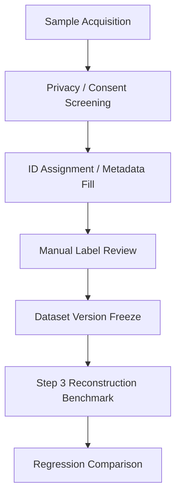

# Input Benchmark Spec

기준 문서: [../../../plan.md](../../../plan.md), [../../../README.md](../../../README.md), [../../../step.md](../../../step.md)  
적용 단계: Step 2, Step 3, Step 13  
주요 소비 주체: AI 팀, backend worker 팀, QA

## 1. 문서 목적

### 핵심 목적

- 입력 품질 검증 기준의 고정
- reconstruction 평가용 최소 샘플셋 구조 확정
- 실패 케이스의 조기 수집 기준 제공
- Step 3 CLI 및 Step 13 회귀 테스트의 공통 입력 기준 제공

### 이 문서의 범위

- 단일 전신 사진 benchmark 샘플셋
- `good / warning / reject` 분류 기준
- 파일 naming 규칙
- manifest 필드 규격
- 샘플셋 version 운영 기준

### 이 문서의 비범위

- 실제 모델 성능 수치 보고
- garment fitting 결과 평가
- multi-view 입력 정책
- video 입력 정책

## 2. Step 2 목표 정렬

### Step 2 직접 목표

- 입력 품질 검증 기준 마련
- 실패 케이스 조기 수집
- reconstruction 평가용 최소 샘플셋 구축

### Step 3 연결 목표

- CLI 입력셋으로 즉시 사용 가능한 manifest 확보
- 성공/실패/재업로드 분기 재현 가능 상태 확보
- latency와 quality score의 회귀 비교 가능 상태 확보

## 3. 샘플셋 구성 원칙

### 원칙

- 제품 실제 입력 분포를 부분적으로 반영
- 실패 가능성 높은 케이스의 의도적 포함
- `good`만 많은 왜곡된 샘플셋 지양
- 품질 라벨과 failure reason의 분리
- 이미지 파일과 평가 메타데이터의 분리 저장

### 최소 수량

| 구분 | 최소 수량 | 목적 |
|---|---|---|
| `good` | 20장 이상 | 정상 경로 baseline |
| `warning` | 10장 이상 | 허용 가능하지만 불안정한 경계 사례 |
| `reject` | 10장 이상 | 재업로드 유도 정책 검증 |

### 권장 확장 수량

| 세부 군 | 권장 수량 | 비고 |
|---|---|---|
| loose clothing | 5장 이상 | 체형 추정 왜곡 확인 |
| dark lighting | 5장 이상 | 저조도 민감도 확인 |
| occlusion | 5장 이상 | 팔, 다리, 손 가림 |
| complex background | 5장 이상 | segmentation 안정성 확인 |
| perspective distortion | 5장 이상 | 광각, 상하 각도 왜곡 |

## 4. 샘플셋 토폴로지



## 5. 샘플 포함 기준

### 필수 포함 조건

- 전신 인물 사진
- 성인 1명
- 정면 또는 정면에 가까운 시점
- 몸 전체의 대략적 윤곽 식별 가능 상태
- 품질 라벨링 가능한 수준의 원본 확보

### 제외 권장 조건

- 다중 인물
- 극단적 셀카 구도
- 과도한 필터 적용
- 심한 모션 블러
- 워터마크가 인체를 가리는 이미지
- 저작권 또는 사용 동의 불명확 이미지

## 6. 품질 버킷 정의

### `good`

- 전신 프레임 확보
- 인체 중심 정렬 양호
- 조명과 선명도 안정
- 가림 현상 경미
- reconstruction 성공 기대치 높은 입력

### `warning`

- 처리 허용 가능
- 특정 단계 불안정 가능성 존재
- pose, mask, measurement 중 일부 품질 저하 가능성
- 결과는 생성 가능하나 quality score 하락 가능성

### `reject`

- 재업로드 유도 대상
- full body 확인 불가
- 인체 수 불명확
- 주요 부위 절단 또는 심한 가림
- extreme perspective 또는 심각한 blur

## 7. 품질 속성 축

### 필수 속성

| 속성 | 값 예시 | 의미 |
|---|---|---|
| `subject_count` | `single`, `multiple` | 인물 수 |
| `body_visibility` | `full`, `partial` | 전신 가시성 |
| `occlusion_level` | `none`, `low`, `medium`, `high` | 가림 수준 |
| `lighting_level` | `bright`, `normal`, `dark` | 조명 상태 |
| `blur_level` | `none`, `low`, `medium`, `high` | 블러 수준 |
| `background_complexity` | `simple`, `medium`, `complex` | 배경 복잡도 |
| `perspective_level` | `normal`, `mild`, `extreme` | 원근 왜곡 |
| `clothing_looseness` | `tight`, `normal`, `loose`, `very_loose` | 체형 추정 난이도 |
| `pose_type` | `front_neutral`, `front_arm_out`, `twisted`, `other` | 포즈 유형 |

### 권장 추가 속성

- `camera_height_band`
- `image_orientation`
- `head_visibility`
- `hand_visibility`
- `foot_visibility`
- `mirror_selfie_flag`
- `backlight_flag`

## 8. failure reason taxonomy

### primary_reason 후보

- `MULTI_PERSON`
- `BODY_TRUNCATED`
- `SEVERE_OCCLUSION`
- `LOW_LIGHT`
- `HEAVY_BLUR`
- `EXTREME_PERSPECTIVE`
- `COMPLEX_BACKGROUND`
- `LOOSE_CLOTHING`
- `NON_FRONTAL_POSE`
- `INVALID_IMAGE_FILE`

### secondary_reason 후보

- `HEAD_CROPPED`
- `FEET_CROPPED`
- `ARMS_HIDDEN`
- `HANDS_HIDDEN`
- `SHADOW_HEAVY`
- `BACKLIGHT`
- `MOTION_BLUR`
- `LOW_RESOLUTION`
- `MIRROR_REFLECTION`
- `POSE_TWIST`

### 분리 원칙

- 품질 라벨은 1개
- primary reason은 최대 1개
- secondary reason은 복수 허용
- `good`에도 관찰 메모 기록 가능

## 9. 디렉터리 구조

### 권장 구조

```text
dataset/input-benchmark/
├── VERSION
├── manifest.csv
├── images/
│   ├── good/
│   ├── warning/
│   └── reject/
├── annotations/
│   ├── sample_0001.json
│   ├── sample_0002.json
│   └── ...
└── reports/
    ├── review-log.md
    └── coverage-summary.md
```

### 저장소 적용 원칙

- 실제 이미지의 Git 저장 여부는 별도 정책
- 저장소 내부에는 문서, template, manifest 예시 위주
- 이미지 바이너리는 private object storage 또는 secure shared drive 보관 권장

## 10. naming 규칙

### 샘플 ID 규칙

- 형식: `sample_0001`
- 고정 길이 숫자 suffix 권장
- 라벨과 파일명 분리
- 파일명 변경보다 manifest 수정 우선

### 파일명 규칙

| 항목 | 예시 |
|---|---|
| 원본 이미지 | `sample_0001.jpg` |
| annotation | `sample_0001.json` |
| preview crop | `sample_0001.preview.jpg` |
| benchmark row key | `sample_0001` |

### 금지 규칙

- 공백 포함
- 한글 파일명 혼용
- 날짜만으로 식별
- 라벨을 파일명에 직접 포함

## 11. manifest 필드 규격

### 필수 컬럼

| 컬럼 | 의미 |
|---|---|
| `sample_id` | 고유 샘플 ID |
| `split_label` | `good`, `warning`, `reject` |
| `file_name` | 이미지 파일명 |
| `subject_count` | 인물 수 |
| `body_visibility` | 전신 가시성 |
| `occlusion_level` | 가림 수준 |
| `lighting_level` | 조명 상태 |
| `blur_level` | 블러 수준 |
| `background_complexity` | 배경 복잡도 |
| `perspective_level` | 원근 왜곡 |
| `clothing_looseness` | 의복 느슨함 |
| `primary_reason` | 주 실패 원인 |
| `secondary_reasons` | 보조 원인 목록 |
| `review_status` | `draft`, `reviewed`, `approved` |
| `notes` | 자유 메모 |

### 권장 컬럼

- `source_group`
- `consent_status`
- `reviewer`
- `reviewed_at`
- `dataset_version`
- `width`
- `height`
- `mime_type`

## 12. annotation JSON 권장 구조

```json
{
  "sample_id": "sample_0001",
  "split_label": "warning",
  "review_status": "approved",
  "quality_attributes": {
    "subject_count": "single",
    "body_visibility": "full",
    "occlusion_level": "medium",
    "lighting_level": "normal",
    "blur_level": "low",
    "background_complexity": "complex",
    "perspective_level": "normal",
    "clothing_looseness": "loose",
    "pose_type": "front_neutral"
  },
  "primary_reason": "LOOSE_CLOTHING",
  "secondary_reasons": [
    "COMPLEX_BACKGROUND"
  ],
  "notes": "상의 실루엣이 넓고 허리선 식별 난이도 존재"
}
```

## 13. 샘플셋 리뷰 정책

### 리뷰 단계

1. 초안 등록
2. 1차 라벨링
3. 2차 검수
4. 승인
5. dataset version 동결

### 승인 기준

- 필수 메타데이터 누락 없음
- 품질 라벨과 reason 일관성 확보
- 중복 샘플 과다 없음
- `good / warning / reject` 비율 편중 과다 없음

## 14. coverage 점검 기준

### 최소 coverage 항목

- 성별 표현 다양성
- 체형 다양성
- 상의 핏 다양성
- 하의 길이 다양성
- 배경 단순/복잡 사례 공존
- 조명 정상/저조도 공존

### 편향 경고 신호

- `good` 비중 70% 초과
- 특정 의복 형태 과다 집중
- low-light 사례 부재
- occlusion 사례 부재
- reject 사례가 단순 저해상도에만 집중

## 15. 개인정보 및 사용 정책

### 필수 정책

- 사용 동의 범위 기록
- 식별 민감도 높은 메타데이터 최소화
- 외부 공유 금지 정책 명시
- 필요 시 식별 정보 blur 사본 별도 생성

### 보관 원칙

- 원본 공개 저장소 업로드 금지
- 사내 private storage 사용 권장
- dataset version별 접근 권한 기록 권장

## 16. Step 2 완료 기준

- `good / warning / reject` 정책 문서화 완료
- manifest 필드 확정
- review checklist 확정
- Step 3 CLI가 읽을 수 있는 benchmark manifest 구조 확보
- baseline 보고 템플릿과 연결 완료

## 17. 연결 문서

- [input-labeling-guide.md](./input-labeling-guide.md)
- [review-checklist.md](./review-checklist.md)
- [templates/benchmark-manifest-template.csv](./templates/benchmark-manifest-template.csv)
- [../benchmarks/reconstruction-benchmark-template.md](../benchmarks/reconstruction-benchmark-template.md)
