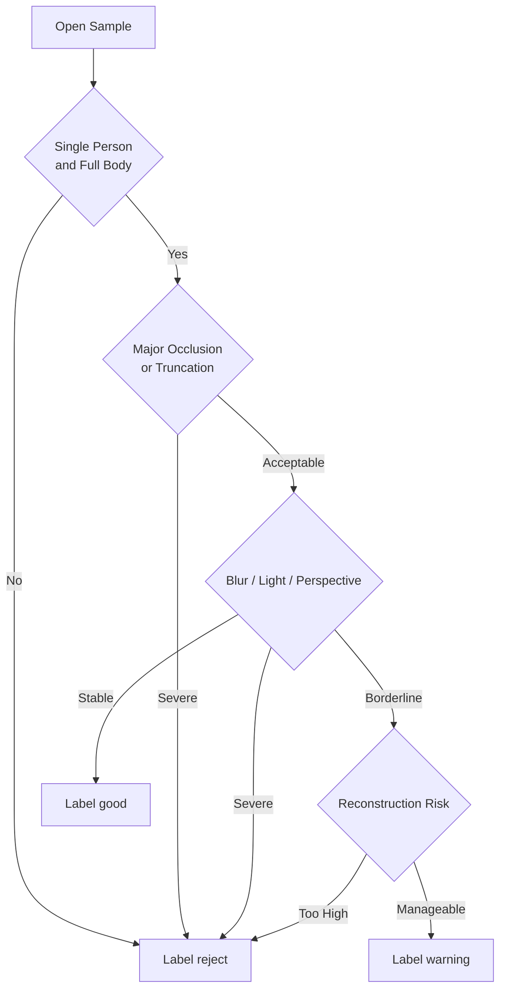

# Input Labeling Guide

기준 문서: [../../../plan.md](../../../plan.md), [../../../README.md](../../../README.md), [../../../step.md](../../../step.md)  
적용 단계: Step 2, Step 13  
주요 소비 주체: AI 팀, QA, 운영 검수 담당

## 1. 문서 목적

### 핵심 목적

- 샘플 라벨링 편차 축소
- `good / warning / reject` 판정 기준 고정
- failure reason taxonomy 적용 기준 제공
- 리뷰어 간 합의 포인트 명시

## 2. 라벨 결정 순서

## 3. 상위 판정 규칙

### `good` 판정

- 전신 식별 명확
- 단일 인물 명확
- 손, 발, 머리 절단 없음 또는 경미
- 가림 현상 경미
- 배경 복잡도 허용 범위
- 조명과 블러 안정
- body silhouette 추정 용이

### `warning` 판정

- 전신 확인 가능
- 처리 자체는 가능
- 특정 단계의 불안정성 예상
- pose 추정, segmentation, measurement 중 최소 1개 리스크 존재
- 재업로드 강제 수준은 아님

### `reject` 판정

- 재구성 성공 가능성 현저히 낮음
- 전신 미포함 또는 다중 인물
- 핵심 부위 심각한 절단
- severe occlusion
- extreme blur 또는 very dark lighting
- perspective 왜곡이 신체 비율 판단을 방해

## 4. 속성별 상세 판정

### 인물 수

| 상태 | 판정 기준 | 기본 라벨 영향 |
|---|---|---|
| `single` | 단일 피사체 명확 | 정상 진행 가능 |
| `multiple` | 다른 사람 신체 일부라도 혼입 | 기본 `reject` |

### 전신 가시성

| 상태 | 판정 기준 | 기본 라벨 영향 |
|---|---|---|
| `full` | 머리부터 발끝까지 확인 가능 | 정상 |
| `partial` | 발 또는 머리 일부 누락 | 경계 |
| `truncated_major` | 허리 이하, 어깨 이상 등 주요 구간 누락 | 기본 `reject` |

### 가림 수준

| 상태 | 예시 | 기본 라벨 영향 |
|---|---|---|
| `none` | 가림 거의 없음 | 정상 |
| `low` | 손 일부 가림 | `good` 가능 |
| `medium` | 팔, 다리 일부 가림 | `warning` 우선 |
| `high` | 몸통 실루엣 식별 어려움 | 기본 `reject` |

### 조명

| 상태 | 예시 | 기본 라벨 영향 |
|---|---|---|
| `bright` | 과도한 노출 없는 밝은 환경 | 정상 |
| `normal` | 실내/실외 평균 수준 | 정상 |
| `dark` | silhouette는 보이나 세부 감소 | `warning` 가능 |
| `very_dark` | 윤곽 파악 어려움 | 기본 `reject` |

### 블러

| 상태 | 예시 | 기본 라벨 영향 |
|---|---|---|
| `none` | 선명 | 정상 |
| `low` | 미세 흔들림 | `good` 가능 |
| `medium` | 경계 약화 | `warning` 우선 |
| `high` | 인체 contour 붕괴 | 기본 `reject` |

### 원근 왜곡

| 상태 | 예시 | 기본 라벨 영향 |
|---|---|---|
| `normal` | 자연스러운 정면 시점 | 정상 |
| `mild` | 약한 상하 각도 | `warning` 가능 |
| `extreme` | 상체/하체 비율 왜곡 심함 | 기본 `reject` |

## 5. 대표 failure reason 매핑

| 관찰 패턴 | primary reason | 기본 라벨 |
|---|---|---|
| 두 명 이상 등장 | `MULTI_PERSON` | `reject` |
| 발끝 누락 + 하체 미확인 | `BODY_TRUNCATED` | `reject` |
| 상체를 가방/가구가 크게 가림 | `SEVERE_OCCLUSION` | `reject` |
| 전체 어두움 | `LOW_LIGHT` | `warning` 또는 `reject` |
| 강한 흔들림 | `HEAVY_BLUR` | `reject` |
| 광각 셀카 | `EXTREME_PERSPECTIVE` | `reject` |
| 복잡 배경이지만 인체 분리 가능 | `COMPLEX_BACKGROUND` | `warning` |
| 루즈핏 코트/원피스 | `LOOSE_CLOTHING` | `warning` |
| 몸이 비틀린 정면 사진 | `NON_FRONTAL_POSE` | `warning` 또는 `reject` |

## 6. ambiguous case 처리 기준

### loose clothing

- 전신과 윤곽은 보임
- 체형 추정만 어렵고 segmentation 가능
- 기본 `warning`
- 몸통 윤곽 소실 수준이면 `reject`

### dark lighting

- 윤곽 유지 시 `warning`
- 상하체 경계 확인 곤란 시 `reject`

### complex background

- 사람 bbox 추정 가능 시 `warning`
- 배경 객체와 신체 윤곽 혼동 심할 시 `reject`

### mirror selfie

- 거울 프레임과 손 위치가 경미하면 `warning`
- 폰이 몸통 중앙을 크게 가리면 `reject`

## 7. 리뷰어 메모 규칙

### 메모에 반드시 남길 것

- 라벨 근거
- primary reason 선택 근거
- 수동 판정이 애매했던 축
- 추후 모델 개선 포인트

### 메모에서 피할 것

- 개인 식별 정보
- 불필요한 감상 표현
- 라벨과 무관한 장문 설명

## 8. 이중 검수 규칙

### 권장 조건

- `warning`과 `reject` 전수 이중 검수
- `good`은 랜덤 20% 이중 검수
- 불일치 사례 별도 합의 로그 유지

### 불일치 해결 우선순위

1. 전신 가시성
2. 인물 수
3. severe occlusion 여부
4. blur / lighting / perspective
5. loose clothing 영향

## 9. 라벨링 QA 지표

### 필수 지표

- 리뷰어 간 일치율
- label 분포
- primary reason 분포
- 보류 샘플 수
- 재검수 비율

### 경고 기준

- `reject` 비율 10% 미만
- `warning` 비율 10% 미만
- 특정 reason이 전체의 50% 초과
- 리뷰어 불일치율 15% 초과

## 10. Step 2 완료 기준

- 리뷰어가 같은 기준으로 샘플 분류 가능 상태
- 애매한 사례에 대한 공통 판정 규칙 확보
- Step 3 전 사전 gating 정책 문서화 완료

## 11. 연결 문서

- [input-benchmark-spec.md](./input-benchmark-spec.md)
- [review-checklist.md](./review-checklist.md)
- [templates/benchmark-manifest-template.csv](./templates/benchmark-manifest-template.csv)
