# Backend Architecture README

가상 피팅 플랫폼 백엔드 상세 설계 문서  


## Table of Contents

- [1. Document Role](#1-document-role)
- [2. Backend Mission](#2-backend-mission)
- [3. Scope](#3-scope)
- [4. Non-Goals](#4-non-goals)
- [5. Backend Core Principles](#5-backend-core-principles)
- [6. System Context](#6-system-context)
- [7. Service Boundary](#7-service-boundary)
- [8. Backend Runtime Flow](#8-backend-runtime-flow)
- [9. API Design Overview](#9-api-design-overview)
- [10. Endpoint Catalog](#10-endpoint-catalog)
- [11. Request and Response Contracts](#11-request-and-response-contracts)
- [12. Auth and Permission Model](#12-auth-and-permission-model)
- [13. Validation Strategy](#13-validation-strategy)
- [14. Job Orchestration](#14-job-orchestration)
- [15. Queue and Worker Contracts](#15-queue-and-worker-contracts)
- [16. Job State Machine](#16-job-state-machine)
- [17. Event Model and SSE](#17-event-model-and-sse)
- [18. Domain Models](#18-domain-models)
- [19. MongoDB Design](#19-mongodb-design)
- [20. Object Storage Design](#20-object-storage-design)
- [21. Error Model](#21-error-model)
- [22. Retry, Timeout, Backpressure](#22-retry-timeout-backpressure)
- [23. Security and Privacy](#23-security-and-privacy)
- [24. Observability](#24-observability)
- [25. Performance and Scaling](#25-performance-and-scaling)
- [26. Suggested Backend Folder Structure](#26-suggested-backend-folder-structure)
- [27. Environment Variables](#27-environment-variables)
- [28. Testing Strategy](#28-testing-strategy)
- [29. Deployment Notes](#29-deployment-notes)
- [30. Implementation Roadmap](#30-implementation-roadmap)
- [31. Open Backend Questions](#31-open-backend-questions)

## 1. Document Role

### Main Purpose

- 백엔드 구현 기준 문서 역할
- API 계약 문서 역할
- job orchestration 기준 문서 역할
- worker 연동 규약 문서 역할
- 데이터 저장 구조 문서 역할
- 운영 및 장애 대응 기준 문서 역할


## 2. Backend Mission

### Backend의 핵심 역할

- 업로드와 장시간 처리의 분리
- API 서버와 계산 워커의 분리
- 상태 전이의 일관성 보장
- 중간 산출물과 최종 산출물의 추적 가능성 보장
- 사용자용 상태와 내부 처리 상태의 연결
- 장애 원인과 실패 지점의 명확한 기록

### Backend 성공 기준

- 장시간 작업의 HTTP 타임아웃 회피
- job 상태의 재현 가능성
- worker crash 상황에서도 상태 추적 가능성
- storage, DB, queue 간 데이터 정합성 유지
- 프론트엔드에 안정적인 metadata 제공

## 3. Scope

### Backend MVP Scope

- presigned upload URL 발급
- reconstruction job 생성
- job 상태 조회
- SSE progress stream 제공
- garment catalog API 제공
- fitting 시작 API 제공
- result metadata API 제공
- admin garment 등록/전처리 API 골격 제공
- MongoDB 메타데이터 저장
- S3/MinIO object key 저장
- Redis 기반 queue orchestration

### Backend 산출물 범위

- FastAPI API 서버
- worker task contract
- queue naming 규약
- DB schema
- object storage key 규약
- status/event model
- auth skeleton
- observability skeleton

## 4. Non-Goals

### 초기 백엔드 비목표

- 모델 학습 파이프라인 포함
- 다중 region active-active 운영
- complex multi-tenant billing
- webhook 생태계 확장
- 강한 실시간 협업 기능
- production-grade IAM 전체 설계 완성

## 5. Backend Core Principles

### Principle 1: API Server의 계산 책임 최소화

핵심 기준:

- API 서버의 orchestration 집중
- GPU/Blender 연산의 worker 분리
- 대용량 바이너리 업로드의 direct upload 우선

### Principle 2: Job 중심 상태 관리

핵심 기준:

- 모든 긴 작업의 `job_id` 기준 추적
- 단계별 상태와 이벤트 기록
- 상태 전이 규칙 명시
- 실패와 재시도 정책 분리

### Principle 3: Metadata와 Binary 분리

핵심 기준:

- MongoDB: metadata, 상태, 참조 키 저장
- Object Storage: image, mesh, texture, glb 저장
- DB에는 object key와 summary 정보 저장

### Principle 4: Worker 독립성과 계약 중심 설계

핵심 기준:

- API와 worker 간 message contract 명확화
- worker 간 handoff payload 최소화
- artifact manifest 기반 후속 단계 실행

### Principle 5: 디버깅 가능한 시스템 우선

중요 기준:

- intermediate artifact 보존
- event log 보존
- correlation id 기반 추적
- quality score와 failure code 분리 저장

## 6. System Context

### Backend Context Diagram

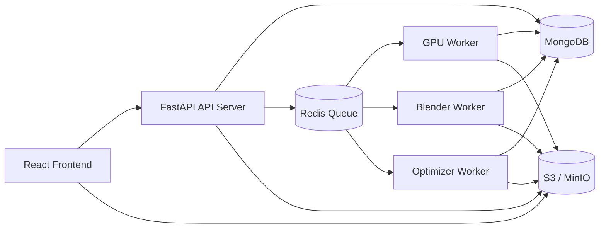

### Backend Context Summary

- 클라이언트와 API 간 경량 metadata 통신
- 클라이언트와 storage 간 direct upload
- API와 worker 간 queue 기반 비동기 연결
- worker와 DB/storage 간 결과 기록 구조

## 7. Service Boundary

### Service Split

| 서비스 | 책임 |
|---|---|
| FastAPI API Server | 인증, presign, job 생성, 상태 조회, catalog, metadata |
| GPU Worker | validation, segmentation, pose, reconstruction, canonicalization |
| Blender Worker | garment fitting, scaling, rig alignment, draping |
| Optimizer Worker | final glb 최적화, texture 압축, thumbnail 생성 |
| Redis | queue broker |
| MongoDB | metadata 및 상태 저장 |
| S3/MinIO | 바이너리 산출물 저장 |

### Why Separate Services

- HTTP request lifecycle와 GPU 작업 분리 목적
- 장애 범위 분리 목적
- scale-out 단위 분리 목적
- 운영 시 병목 식별 용이성 목적

### Ownership Boundary

- API Server: request validation, permission, orchestration
- GPU Worker: body artifact 생성 ownership
- Blender Worker: fitting artifact 생성 ownership
- Optimizer Worker: delivery artifact 생성 ownership

## 8. Backend Runtime Flow

### End-to-End Backend Sequence

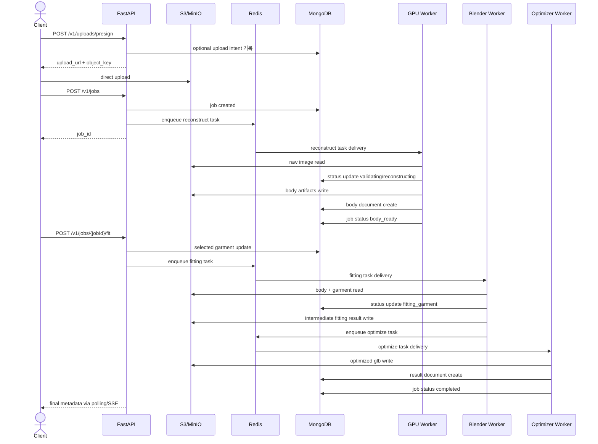

### Runtime Flow Summary

1. presign 발급
2. direct upload
3. reconstruction job 생성
4. GPU worker 수행
5. body_ready 전이
6. fitting 요청
7. Blender worker 수행
8. optimize worker 수행
9. completed 상태 전이

## 9. API Design Overview

### API Design Goals

- 프론트엔드에 단순하고 예측 가능한 interface 제공
- 장시간 job을 immediate response + async processing 모델로 제공
- 실패 시 human-readable message + machine-readable error code 제공
- URL 구조의 리소스 중심 설계

### API Style

- REST-like resource design
- JSON request/response
- async job creation endpoints
- SSE event stream for progress

### Response Design Priorities

- `job_id`, `body_id`, `result_id` 분리
- status, progress_step, progress_percent 분리
- nullable field의 명확한 사용
- client-safe message와 internal debug code 분리

## 10. Endpoint Catalog

### Main API Endpoints

| Method | Path | 목적 | 동기/비동기 |
|---|---|---|---|
| `POST` | `/v1/uploads/presign` | direct upload URL 발급 | 동기 |
| `POST` | `/v1/jobs` | reconstruction job 생성 | 동기 |
| `GET` | `/v1/jobs/{jobId}` | job 상태 조회 | 동기 |
| `GET` | `/v1/jobs/{jobId}/events` | progress SSE | 스트림 |
| `GET` | `/v1/garments` | garment 목록 조회 | 동기 |
| `GET` | `/v1/garments/{garmentId}` | garment 상세 조회 | 동기 |
| `POST` | `/v1/jobs/{jobId}/fit` | fitting 시작 | 동기 |
| `GET` | `/v1/results/{resultId}` | 최종 결과 조회 | 동기 |
| `POST` | `/v1/admin/garments` | garment 등록 | 동기 |
| `POST` | `/v1/admin/garments/{garmentId}/preprocess` | garment 전처리 시작 | 동기 |

### Optional Future Endpoints

| Method | Path | 목적 |
|---|---|---|
| `POST` | `/v1/jobs/{jobId}/cancel` | job 취소 |
| `GET` | `/v1/jobs` | job 목록 조회 |
| `DELETE` | `/v1/results/{resultId}` | 결과 삭제 |
| `GET` | `/v1/admin/jobs` | 운영자용 job 모니터링 |

## 11. Request and Response Contracts

### 11.1 Presign Upload

#### Request

```json
{
  "filename": "user_photo.jpg",
  "content_type": "image/jpeg",
  "file_size": 5242880
}
```

#### Response

```json
{
  "upload_url": "https://storage.example.com/...",
  "object_key": "raw-images/2026/03/23/job_xxx/original.jpg",
  "expires_in": 900
}
```

#### Validation Points

- filename 존재 여부
- content_type 허용 목록 여부
- file_size 최대 한도 여부

### 11.2 Create Reconstruction Job

#### Request

```json
{
  "image_object_key": "raw-images/2026/03/23/job_xxx/original.jpg",
  "user_id": "user_123"
}
```

#### Response

```json
{
  "job_id": "job_123",
  "status": "created"
}
```

#### Validation Points

- image_object_key 존재 여부
- 허용 namespace 여부
- 사용자 소유권 여부
- 이미 처리된 동일 image_object_key에 대한 idempotency 정책 여부

### 11.3 Get Job Status

#### Response

```json
{
  "job_id": "job_123",
  "status": "reconstructing_body",
  "progress_step": "reconstructing_mesh",
  "progress_percent": 45,
  "body_id": null,
  "result_id": null,
  "error_code": null,
  "message": "3D body 생성 중"
}
```

### 11.4 Job Events SSE

#### Event Format

```text
event: progress
data: {"job_id":"job_123","status":"extracting_measurements","progress_step":"measuring_body","progress_percent":65}
```

#### Event Types

- `progress`
- `warning`
- `completed`
- `failed`

### 11.5 Garment List

#### Query Examples

- `/v1/garments?category=top&page=1`
- `/v1/garments?category=outer&page=1&page_size=12`

#### Response Example

```json
{
  "items": [
    {
      "garment_id": "garment_001",
      "name": "Basic Jacket",
      "category": "outer",
      "thumbnail_url": "https://cdn.example.com/garments/garment_001/thumb.jpg",
      "base_size": "M",
      "status": "ready"
    }
  ],
  "page": 1,
  "page_size": 12,
  "total": 1
}
```

### 11.6 Start Fitting

#### Request

```json
{
  "garment_id": "garment_001",
  "fit_mode": "fast"
}
```

#### Response

```json
{
  "job_id": "job_123",
  "status": "garment_selected",
  "selected_garment_id": "garment_001"
}
```

#### Preconditions

- job 존재
- job owner 일치
- job status가 `body_ready`
- garment status가 `ready`

### 11.7 Get Result

#### Response

```json
{
  "result_id": "result_123",
  "job_id": "job_123",
  "body_id": "body_123",
  "garment_id": "garment_001",
  "glb_url": "https://cdn.example.com/results/result_123/final.glb",
  "thumbnail_url": "https://cdn.example.com/results/result_123/thumbnail.jpg",
  "measurements": {
    "shoulder_width_cm": 43.2,
    "chest_cm": 96.8,
    "waist_cm": 81.4,
    "hip_cm": 97.1,
    "inseam_cm": 77.0
  }
}
```

### 11.8 Envelope Strategy

권장 방향:

- 단순 endpoint는 flat response 허용
- pagination endpoint는 `items`, `page`, `page_size`, `total` 구조 권장
- error response는 공통 envelope 사용 권장

## 12. Auth and Permission Model

### Auth Scope

- 일반 사용자 API
- 관리자 API
- 내부 worker callback 또는 internal service auth

### Permission Rules

| 리소스 | 일반 사용자 | 관리자 |
|---|---|---|
| own job | 조회 가능 | 조회 가능 |
| other user job | 불가 | 가능 |
| garment catalog | 가능 | 가능 |
| admin garment create | 불가 | 가능 |
| admin preprocess | 불가 | 가능 |

### Ownership Validation

필수 검증:

- `job.user_id == current_user_id`
- `result.job.user_id == current_user_id`
- `image_object_key` namespace가 현재 사용자 소유 영역인지

### Internal Auth

권장 방식:

- worker는 API를 직접 호출하기보다 DB 업데이트를 우선 고려
- internal endpoint 필요 시 service token 또는 network restriction 적용

## 13. Validation Strategy

### Request Validation Layers

1. Pydantic schema validation
2. business rule validation
3. ownership validation
4. storage key validation
5. state transition validation

### Input Validation Examples

| 입력 | 검증 포인트 |
|---|---|
| filename | empty 여부, length 제한 |
| content_type | 허용 mime type 여부 |
| file_size | max size 이하 여부 |
| jobId | 형식 유효성 |
| garment_id | 존재 여부와 status |
| fit_mode | 허용 enum 여부 |

### Business Rule Validation

- `fit` 호출 전에 `body_ready` 여부
- completed job에 대한 duplicate fitting 허용 정책 여부
- failed job에 대한 retry 정책 여부

## 14. Job Orchestration

### Orchestration Goals

- 상태 전이 일관성
- worker handoff 안정성
- event 기록 일관성
- partial failure 대응 가능성

### Orchestration Diagram

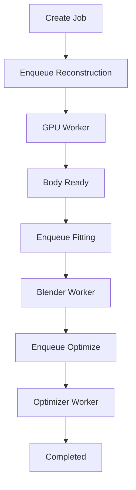

### Recommended Orchestration Responsibility

- API: initial enqueue
- GPU Worker: body artifact 생성 및 next-ready 상태 기록
- API: fitting 요청 기반 enqueue
- Blender Worker: optimize task enqueue
- Optimizer Worker: result document 생성과 completion 처리

### Idempotency Considerations

- `POST /v1/jobs`: 동일 업로드에 대한 중복 job 허용 여부 정책 필요
- `POST /v1/jobs/{jobId}/fit`: 동일 garment 동일 mode 재요청 정책 필요
- worker task: 같은 payload 재수신 시 safe re-run 가능성 중요

## 15. Queue and Worker Contracts

### Queue Names

- `gpu.reconstruct`
- `fit.blender`
- `optimize.result`

### Worker Topology

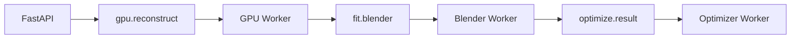

### Reconstruction Task Payload

```json
{
  "task_type": "reconstruct_body",
  "job_id": "job_123",
  "user_id": "user_123",
  "image_object_key": "raw-images/2026/03/23/job_xxx/original.jpg",
  "model_versions": {
    "body_model": "sam3d-body-v1",
    "pose_model": "pose-estimator-v2"
  }
}
```

### Fitting Task Payload

```json
{
  "task_type": "fit_garment",
  "job_id": "job_123",
  "user_id": "user_123",
  "body_id": "body_123",
  "garment_id": "garment_001",
  "fit_mode": "fast"
}
```

### Optimization Task Payload

```json
{
  "task_type": "optimize_result",
  "job_id": "job_123",
  "user_id": "user_123",
  "body_id": "body_123",
  "garment_id": "garment_001",
  "intermediate_glb_key": "results/result_123/intermediate.glb"
}
```

### Worker Contract Principles

- payload는 self-contained에 가깝게 유지
- 필수 식별자 포함
- artifact path 명시
- version 정보 포함
- retry-safe 설계

## 16. Job State Machine

### State Diagram

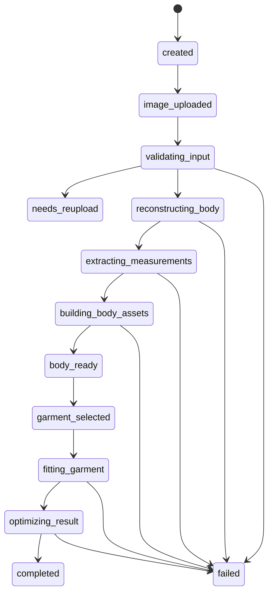

### State Ownership

| 상태 | 소유 주체 |
|---|---|
| `created` | API |
| `image_uploaded` | API |
| `validating_input` | GPU Worker |
| `reconstructing_body` | GPU Worker |
| `extracting_measurements` | GPU Worker |
| `building_body_assets` | GPU Worker |
| `body_ready` | GPU Worker |
| `garment_selected` | API |
| `fitting_garment` | Blender Worker |
| `optimizing_result` | Optimizer Worker 또는 Blender handoff 직후 API 정책 |
| `completed` | Optimizer Worker |
| `failed` | 각 단계 |
| `needs_reupload` | GPU Worker |

### Transition Validation Rules

- `fit` 시작 전 `body_ready` 필수
- `completed` 후 추가 fitting 허용 정책 분리 필요
- `failed`에서 재시작 허용 시 별도 retry endpoint 필요

## 17. Event Model and SSE

### Event Storage Purpose

- 프론트엔드 progress 업데이트
- 운영자 디버깅
- 상태 전이 이력 보존

### Event Schema Example

```json
{
  "_id": "evt_123",
  "job_id": "job_123",
  "event_type": "progress",
  "status": "reconstructing_body",
  "progress_step": "reconstructing_mesh",
  "progress_percent": 45,
  "message": "3D body 생성 중",
  "created_at": "2026-03-23T12:00:08Z"
}
```

### SSE Model

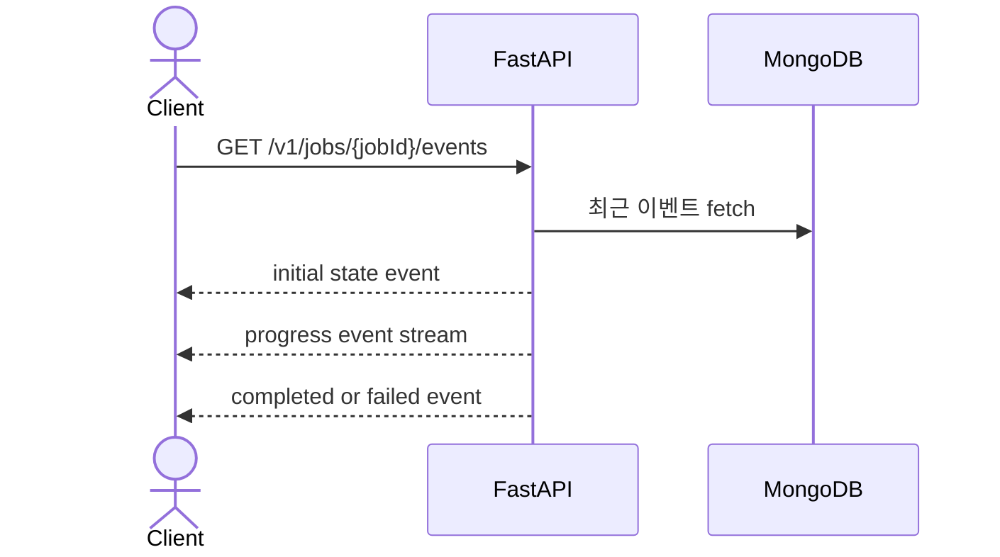

### SSE Requirements

- heartbeat 지원 검토
- last known state 전송
- 연결 종료 시 polling fallback 가능성 고려
- auth 검증 필요

## 18. Domain Models

### Main Resource Model

- `Job`
- `Body`
- `Garment`
- `Result`
- `JobEvent`

### Domain Relation Diagram

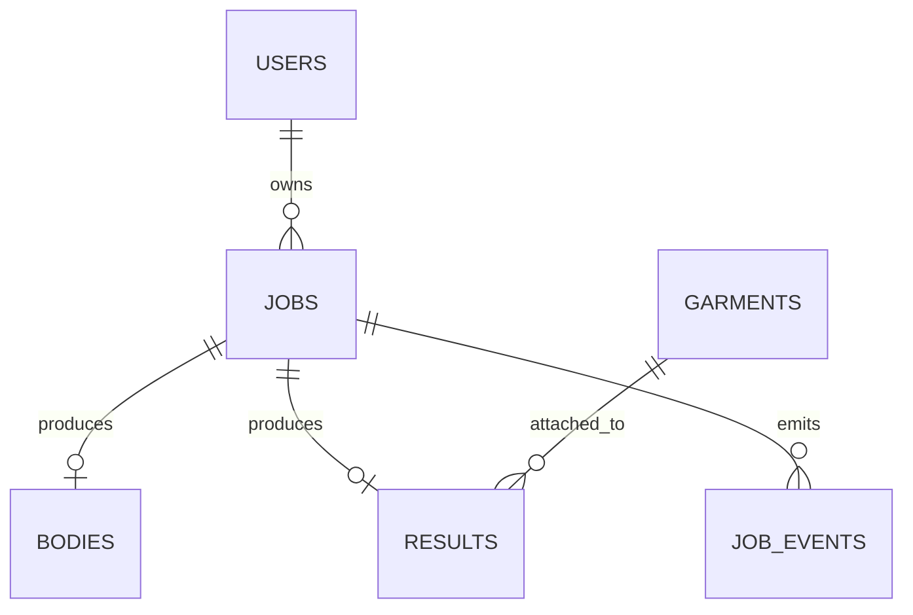

### Domain Meaning

| 리소스 | 의미 |
|---|---|
| Job | 전체 처리 흐름 단위 |
| Body | reconstruction 산출물 |
| Garment | catalog 자산 |
| Result | fitting 최종 결과 |
| JobEvent | 상태 변화 이력 |

## 19. MongoDB Design

### Collections

- `users`
- `jobs`
- `bodies`
- `garments`
- `results`
- `job_events`

### Jobs Document Example

```json
{
  "_id": "job_123",
  "user_id": "user_123",
  "status": "reconstructing_body",
  "progress_step": "reconstructing_mesh",
  "progress_percent": 45,
  "image_object_key": "raw-images/2026/03/23/job_xxx/original.jpg",
  "body_id": null,
  "selected_garment_id": null,
  "result_id": null,
  "error_code": null,
  "error_message": null,
  "model_versions": {
    "body_model": "sam3d-body-v1",
    "pose_model": "pose-estimator-v2"
  },
  "timings": {
    "validation_ms": 0,
    "reconstruction_ms": 0,
    "fitting_ms": 0,
    "optimization_ms": 0
  },
  "created_at": "2026-03-23T12:00:00Z",
  "updated_at": "2026-03-23T12:00:08Z"
}
```

### Bodies Document Example

```json
{
  "_id": "body_123",
  "job_id": "job_123",
  "user_id": "user_123",
  "body_model_type": "smplx",
  "canonical_pose": "A-pose",
  "mesh_object_key": "bodies/body_123/body_canonical.obj",
  "glb_object_key": "bodies/body_123/body_preview.glb",
  "texture_object_keys": {
    "albedo": "bodies/body_123/textures/albedo.png",
    "normal": "bodies/body_123/textures/normal.png"
  },
  "measurements": {
    "height_cm": 172.1,
    "shoulder_width_cm": 43.2,
    "chest_cm": 96.8,
    "waist_cm": 81.4,
    "hip_cm": 97.1
  },
  "quality_scores": {
    "segmentation": 0.94,
    "pose": 0.89,
    "body_reconstruction": 0.82
  },
  "created_at": "2026-03-23T12:00:25Z"
}
```

### Garments Document Example

```json
{
  "_id": "garment_001",
  "name": "Basic Jacket",
  "category": "outer",
  "base_size": "M",
  "gender_profile": "unisex",
  "asset_keys": {
    "source_glb": "garments/garment_001/source.glb",
    "runtime_glb": "garments/garment_001/runtime.glb"
  },
  "fit_profile": {
    "supports_fast_fit": true,
    "supports_cloth_sim": true,
    "collision_margin_mm": 4,
    "anchor_points": ["neck", "left_shoulder", "right_shoulder", "spine", "hip"]
  },
  "material_profiles": {
    "fabric_type": "cotton",
    "roughness_default": 0.82,
    "normal_strength": 0.6
  },
  "size_measurements": {
    "chest_cm": 102,
    "waist_cm": 96,
    "shoulder_cm": 46,
    "sleeve_cm": 61
  },
  "status": "ready"
}
```

### Results Document Example

```json
{
  "_id": "result_123",
  "job_id": "job_123",
  "body_id": "body_123",
  "garment_id": "garment_001",
  "fit_mode": "fast",
  "result_glb_key": "results/result_123/final.glb",
  "thumbnail_key": "results/result_123/thumbnail.jpg",
  "debug_keys": {
    "before_drape_glb": "results/result_123/debug/before_drape.glb",
    "collision_report_json": "results/result_123/debug/collision.json"
  },
  "created_at": "2026-03-23T12:00:52Z"
}
```

### Recommended Indexes

- `jobs.user_id + created_at`
- `jobs.status + updated_at`
- `bodies.job_id`
- `results.job_id`
- `garments.category + status`
- `job_events.job_id + created_at`

### TTL Candidates

- raw upload intents
- failed debug artifacts metadata
- temporary event logs with low business value

## 20. Object Storage Design

### Object Key Convention

```text
raw-images/{yyyy}/{mm}/{dd}/{jobId}/original.jpg
preprocessed/{jobId}/normalized.png
masks/{jobId}/person_mask.png
poses/{jobId}/keypoints.json
bodies/{bodyId}/body_canonical.obj
bodies/{bodyId}/body_preview.glb
bodies/{bodyId}/textures/albedo.png
bodies/{bodyId}/textures/normal.png
garments/{garmentId}/source.glb
garments/{garmentId}/runtime.glb
results/{resultId}/intermediate.glb
results/{resultId}/final.glb
results/{resultId}/thumbnail.jpg
results/{resultId}/debug/before_drape.glb
results/{resultId}/debug/collision.json
```

### Storage Principles

- immutable object key 선호
- overwrite 최소화
- intermediate artifact와 final artifact 분리
- debug artifact 별도 namespace 분리

### Presigned Upload Rules

- 짧은 만료 시간
- 허용 MIME type 제한
- 사용자 namespace 제한
- 필요 시 content-length-range 제한

## 21. Error Model

### Error Design Goals

- 사용자 친화적 메시지
- 운영 친화적 debug code
- retry 가능성 표현
- failure category 표준화

### Common Error Response

```json
{
  "error": {
    "code": "JOB_INVALID_STATE",
    "message": "현재 단계에서는 피팅을 시작할 수 없습니다.",
    "retryable": false
  }
}
```

### Error Categories

| category | 예시 code |
|---|---|
| validation | `INVALID_FILE_TYPE`, `INVALID_FILE_SIZE` |
| auth | `UNAUTHORIZED`, `FORBIDDEN` |
| state | `JOB_INVALID_STATE` |
| resource | `JOB_NOT_FOUND`, `GARMENT_NOT_FOUND` |
| storage | `UPLOAD_URL_GENERATION_FAILED` |
| worker | `RECONSTRUCTION_FAILED`, `FITTING_FAILED` |
| internal | `INTERNAL_SERVER_ERROR` |

### User Message vs Internal Code

- `message`: 사용자 노출용
- `code`: 로그, 모니터링, support 대응용

## 22. Retry, Timeout, Backpressure

### Retry Strategy

| 대상 | 정책 |
|---|---|
| presign 발급 실패 | 제한적 자동 재시도 가능 |
| Mongo transient error | 드라이버 retry 또는 app-level retry |
| storage read/write transient error | exponential backoff |
| GPU OOM | delayed retry 또는 concurrency 축소 |
| Blender crash | 1회 재시도 후 fail |
| optimizer 실패 | fallback artifact 정책 검토 |

### Timeout Strategy

- HTTP request: 짧은 응답 시간 유지
- worker task: 단계별 별도 timeout 필요
- SSE connection: heartbeat 또는 idle timeout 정책 필요

### Backpressure Strategy

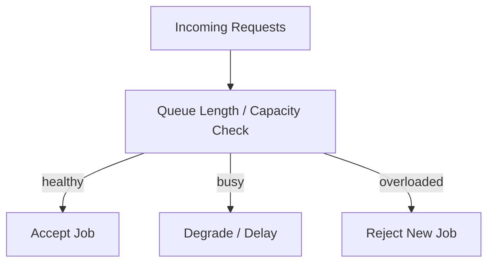

### Admission Control Candidates

- queue length threshold
- GPU available slot
- Blender queue length
- system maintenance flag

## 23. Security and Privacy

### Security Priorities

- object key namespace isolation
- presigned URL misuse 방지
- auth scope 분리
- admin endpoint 보호
- internal network boundary 설정

### Privacy Priorities

- raw image 장기 보관 지양
- debug artifact 최소 보관
- model training 재사용 시 별도 동의 필요
- PII 최소 저장

### Recommended Security Controls

- HTTPS only
- signed result URL
- request size limit
- auth middleware
- admin role check
- structured audit logging

## 24. Observability

### Observability Goals

- 어떤 단계에서 실패했는지 즉시 파악 가능성
- 어떤 garment에서 실패율이 높은지 추적 가능성
- GPU 병목과 Blender 병목의 분리 관찰 가능성

### Required Correlation IDs

- `request_id`
- `job_id`
- `user_id`
- `body_id`
- `result_id`

### Metrics

- API request count
- API error rate
- job created count
- job success rate
- job failure rate
- queue depth per queue
- average reconstruction time
- average fitting time
- average optimization time
- GPU utilization
- Blender crash rate

### Logging Strategy

권장 log fields:

- timestamp
- level
- request_id
- job_id
- status
- progress_step
- error_code
- latency_ms

### Monitoring Diagram

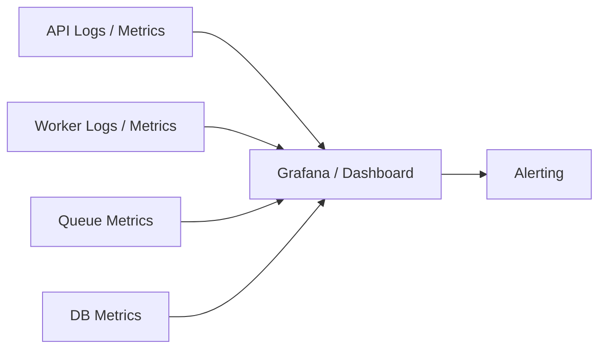

## 25. Performance and Scaling

### Initial Constraints

- RTX 3090 단일 GPU 기준
- reconstruction job concurrency 낮은 시작 권장
- Blender와 GPU 간 리소스 경쟁 가능성

### Scaling Units

- API server horizontal scaling
- GPU worker count scaling
- Blender worker count scaling
- optimizer worker count scaling

### Performance Priorities

- API latency 안정성
- queue 처리량 관리
- artifact I/O 최소화
- unnecessary DB round trip 최소화

### Common Bottlenecks

- GPU inference time
- large asset read/write
- Blender process startup cost
- SSE 연결 수 증가

## 26. Suggested Backend Folder Structure

### Recommended API Structure

```text
backend/api/
├── app/
│   ├── api/
│   │   ├── v1/
│   │   │   ├── uploads.py
│   │   │   ├── jobs.py
│   │   │   ├── garments.py
│   │   │   ├── results.py
│   │   │   └── admin_garments.py
│   ├── core/
│   │   ├── config.py
│   │   ├── security.py
│   │   ├── logging.py
│   │   └── errors.py
│   ├── db/
│   │   ├── mongo.py
│   │   ├── repositories/
│   │   └── indexes.py
│   ├── domain/
│   │   ├── jobs/
│   │   ├── garments/
│   │   ├── results/
│   │   └── uploads/
│   ├── schemas/
│   ├── services/
│   │   ├── uploads_service.py
│   │   ├── jobs_service.py
│   │   ├── garments_service.py
│   │   └── results_service.py
│   └── main.py
├── tests/
└── pyproject.toml
```

### Recommended Worker Structure

```text
ai/workers/
├── gpu-worker/
│   ├── app/
│   │   ├── tasks/
│   │   ├── pipelines/
│   │   ├── services/
│   │   └── main.py
├── blender-worker/
│   ├── app/
│   │   ├── tasks/
│   │   ├── blender_scripts/
│   │   └── main.py
├── optimizer-worker/
│   ├── app/
│   │   ├── tasks/
│   │   ├── optimizers/
│   │   └── main.py
```

### Layering Recommendation

- API route layer
- service layer
- repository layer
- domain validation layer
- worker task layer

## 27. Environment Variables

### Core API Variables

| 변수 | 의미 |
|---|---|
| `APP_ENV` | 실행 환경 |
| `API_PORT` | API 포트 |
| `MONGO_URI` | MongoDB 연결 문자열 |
| `REDIS_URL` | Redis 연결 문자열 |
| `S3_ENDPOINT` | S3/MinIO endpoint |
| `S3_BUCKET` | object storage bucket |
| `AWS_ACCESS_KEY_ID` | storage access key |
| `AWS_SECRET_ACCESS_KEY` | storage secret key |
| `SIGNED_URL_TTL_SECONDS` | presigned URL 만료 시간 |
| `JWT_SECRET` | auth secret |
| `SENTRY_DSN` | 에러 트래킹 |

### Worker Variables

| 변수 | 의미 |
|---|---|
| `WORKER_QUEUE_NAME` | worker queue binding |
| `BODY_MODEL_VERSION` | reconstruction model version |
| `BLENDER_BINARY_PATH` | blender 실행 경로 |
| `GLTF_OPTIMIZER_PATH` | optimizer binary path |
| `MAX_RETRY_COUNT` | retry 횟수 |

### Config Principles

- secret의 코드 내 하드코딩 금지
- environment별 설정 분리
- worker와 API의 공통 config package 고려

## 28. Testing Strategy

### Test Layers

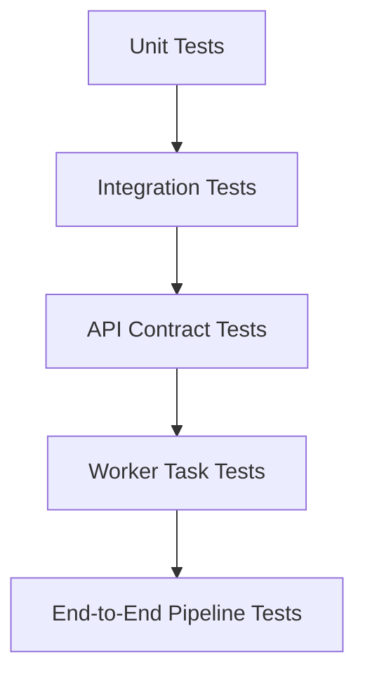

### API Test Targets

- request validation
- auth/permission
- state transition protection
- pagination behavior
- error envelope

### Repository and DB Test Targets

- index creation
- query performance-critical path
- ownership filter correctness

### Worker Test Targets

- queue payload parsing
- artifact key generation
- status update sequence
- retry behavior

### Pipeline Test Targets

- raw image upload -> job creation
- reconstruction success -> body_ready
- fit request -> completed
- failure -> failed / needs_reupload

## 29. Deployment Notes

### Initial Deployment Pattern

- reverse proxy 앞단
- FastAPI app instance
- Redis broker
- MongoDB primary
- S3/MinIO storage
- GPU worker node
- Blender worker node
- optimizer worker node

### Deployment Diagram

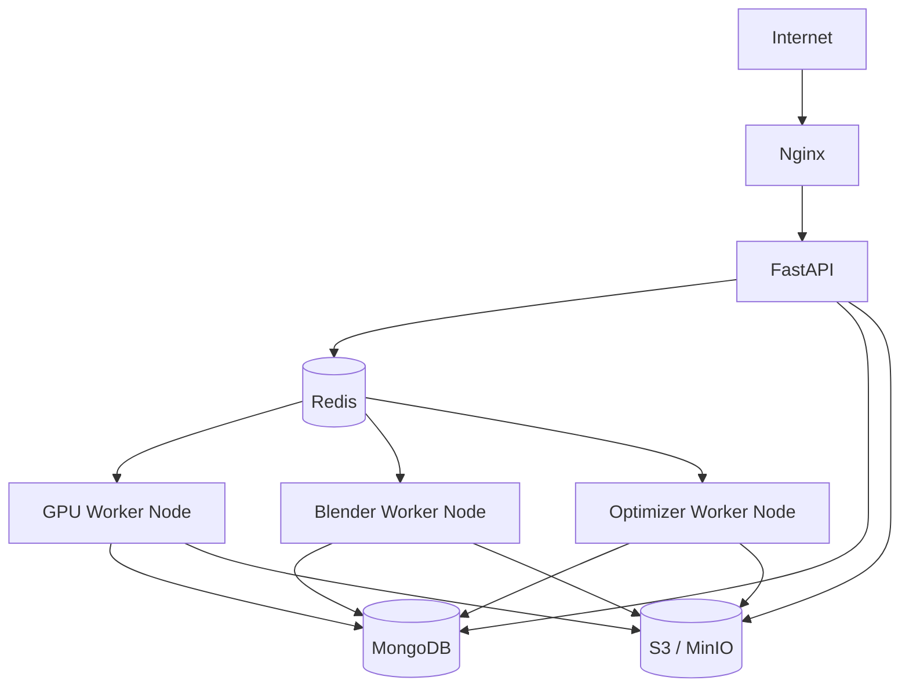

### Deployment Priorities

- API stateless 유지
- worker process isolation
- storage 접근 안정성
- queue durability
- DB backup 정책

## 30. Implementation Roadmap

### Recommended Build Order

1. FastAPI skeleton
2. config / logging / error layer
3. Mongo repositories
4. presign endpoint
5. create job endpoint
6. job status endpoint
7. Redis queue integration
8. GPU worker contract
9. fit endpoint
10. Blender/optimizer handoff
11. SSE endpoint
12. admin garment APIs
13. observability and hardening

### Milestone Breakdown

#### Milestone 1

- presign + create job + get job status
- Mongo 기본 schema
- queue enqueue 동작

#### Milestone 2

- GPU worker와 body_ready 연결
- job_events 기록
- SSE 초기 버전

#### Milestone 3

- garment catalog API
- fitting 요청
- result API

#### Milestone 4

- admin garment API
- retry/backpressure 정책
- metrics/logging 강화

## 31. Open Backend Questions

### API Questions

- `POST /v1/jobs`의 idempotency 기준
- `completed` job에서 재피팅 허용 방식
- SSE와 polling 병행 정책의 기본값

### Data Questions

- intermediate artifact TTL 기준
- `job_events` 장기 보관 필요성
- result 재생성 시 overwrite vs versioning 정책

### Worker Questions

- worker가 DB 직접 쓰는 구조와 internal API callback 구조 중 최종 선택
- Blender worker의 optimize enqueue 주체 확정
- GPU OOM 대응의 queue-level 정책

### Ops Questions

- single 3090 환경의 concurrency 상한
- Blender node 분리 시 네트워크 비용
- signed result URL 캐시 전략
