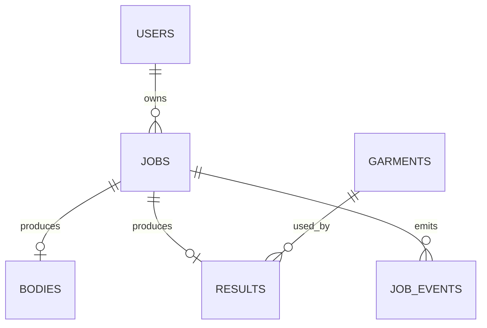

# Mongo Schema Draft

기준 문서: [../../plan.md](../../plan.md), [../../step.md](../../step.md), [./README.md](./README.md)  
적용 단계: Step 1, Step 8, Step 9

## 1. 문서 목적

### 핵심 목적

- MongoDB collection 구조 초안 확정
- 리소스 간 관계 정리
- 상태 저장 필드와 조회 필드 분리
- 인덱스 전략 초안 제공

## 2. 설계 원칙

### 원칙

- metadata 중심 저장
- object storage key 저장
- 바이너리 직접 저장 지양
- 이벤트 이력 분리
- 디버깅 가능한 상태 필드 유지

### Mongo에 저장할 것

- job 상태
- body metadata
- garment metadata
- result metadata
- progress event
- quality score
- artifact key 참조

### Mongo에 저장하지 않을 것

- raw image binary
- glb binary
- texture binary
- 대형 mesh payload

## 3. Collection 개요

### Collection 목록

- `users`
- `jobs`
- `bodies`
- `garments`
- `results`
- `job_events`

### 관계 다이어그램



## 4. ID 규칙

### 권장 규칙

- 문자열 기반 business id 사용
- Mongo ObjectId 의존 최소화

### 예시

- `user_123`
- `job_123`
- `body_123`
- `garment_001`
- `result_123`
- `evt_123`

## 5. users 스키마

### 역할

- 리소스 ownership 기준
- auth 연계 포인트

### 필드

| 필드 | 타입 | 필수 | 의미 |
|---|---|---|---|
| `_id` | string | 필수 | 사용자 ID |
| `email` | string | 선택 | 로그인 연동용 |
| `role` | string | 필수 | `user`, `admin` |
| `created_at` | datetime | 필수 | 생성 시각 |
| `updated_at` | datetime | 필수 | 수정 시각 |

### 예시

```json
{
  "_id": "user_123",
  "email": "user@example.com",
  "role": "user",
  "created_at": "2026-03-23T12:00:00Z",
  "updated_at": "2026-03-23T12:00:00Z"
}
```

## 6. jobs 스키마

### 역할

- 전체 처리 흐름의 중심 리소스
- 현재 상태와 다음 액션 판단 기준

### 필드

| 필드 | 타입 | 필수 | 의미 |
|---|---|---|---|
| `_id` | string | 필수 | job ID |
| `user_id` | string | 필수 | owner |
| `status` | string | 필수 | 현재 상태 |
| `progress_step` | string/null | 선택 | 세부 단계 |
| `progress_percent` | number/null | 선택 | 진행률 |
| `image_object_key` | string | 필수 | 업로드 이미지 key |
| `body_id` | string/null | 선택 | body 연결 |
| `selected_garment_id` | string/null | 선택 | 선택 garment |
| `result_id` | string/null | 선택 | 결과 연결 |
| `error_code` | string/null | 선택 | machine-readable error |
| `error_message` | string/null | 선택 | user-facing error |
| `model_versions` | object | 선택 | 사용 모델 버전 |
| `timings` | object | 선택 | 단계별 소요 시간 |
| `created_at` | datetime | 필수 | 생성 시각 |
| `updated_at` | datetime | 필수 | 수정 시각 |

### 예시

```json
{
  "_id": "job_123",
  "user_id": "user_123",
  "status": "reconstructing_body",
  "progress_step": "reconstructing_mesh",
  "progress_percent": 45,
  "image_object_key": "raw-images/2026/03/23/job_123/original.jpg",
  "body_id": null,
  "selected_garment_id": null,
  "result_id": null,
  "error_code": null,
  "error_message": null,
  "model_versions": {
    "body_model": "sam3d-body-v1",
    "pose_model": "pose-estimator-v2"
  },
  "timings": {
    "validation_ms": 820,
    "reconstruction_ms": 19240,
    "fitting_ms": 0,
    "optimization_ms": 0
  },
  "created_at": "2026-03-23T12:00:00Z",
  "updated_at": "2026-03-23T12:00:21Z"
}
```

### 주의 포인트

- `jobs`는 denormalized current state 보유
- current state 조회 속도 우선
- 이력은 `job_events`에 분리

## 7. bodies 스키마

### 역할

- reconstruction 산출물 metadata
- canonical body 기준 데이터 저장

### 필드

| 필드 | 타입 | 필수 | 의미 |
|---|---|---|---|
| `_id` | string | 필수 | body ID |
| `job_id` | string | 필수 | source job |
| `user_id` | string | 필수 | owner |
| `body_model_type` | string | 필수 | `smpl`, `smplx` 등 |
| `canonical_pose` | string | 필수 | `A-pose` 등 |
| `mesh_object_key` | string | 필수 | canonical mesh key |
| `glb_object_key` | string | 선택 | preview glb key |
| `texture_object_keys` | object | 선택 | texture key map |
| `measurements` | object | 선택 | body measurement map |
| `quality_scores` | object | 선택 | quality metrics |
| `created_at` | datetime | 필수 | 생성 시각 |

### 예시

```json
{
  "_id": "body_123",
  "job_id": "job_123",
  "user_id": "user_123",
  "body_model_type": "smplx",
  "canonical_pose": "A-pose",
  "mesh_object_key": "bodies/body_123/body_canonical.obj",
  "glb_object_key": "bodies/body_123/body_preview.glb",
  "texture_object_keys": {
    "albedo": "bodies/body_123/textures/albedo.png",
    "normal": "bodies/body_123/textures/normal.png"
  },
  "measurements": {
    "height_cm": 172.1,
    "shoulder_width_cm": 43.2,
    "chest_cm": 96.8,
    "waist_cm": 81.4,
    "hip_cm": 97.1
  },
  "quality_scores": {
    "segmentation": 0.94,
    "pose": 0.89,
    "body_reconstruction": 0.82
  },
  "created_at": "2026-03-23T12:00:25Z"
}
```

## 8. garments 스키마

### 역할

- catalog asset metadata
- fitting rule lookup 기준

### 필드

| 필드 | 타입 | 필수 | 의미 |
|---|---|---|---|
| `_id` | string | 필수 | garment ID |
| `name` | string | 필수 | 표시 이름 |
| `category` | string | 필수 | garment category |
| `status` | string | 필수 | `draft`, `ready`, `disabled` |
| `base_size` | string | 필수 | 기준 사이즈 |
| `supported_sizes` | array | 선택 | 지원 사이즈 |
| `gender_profile` | string | 선택 | fit profile |
| `asset_keys` | object | 필수 | source/runtime key map |
| `fit_profile` | object | 필수 | fit capability |
| `material_profiles` | object | 선택 | PBR 설정 |
| `size_measurements` | object | 필수 | 기준 치수 |
| `created_at` | datetime | 필수 | 생성 시각 |
| `updated_at` | datetime | 필수 | 수정 시각 |

### 예시

```json
{
  "_id": "garment_001",
  "name": "Basic Jacket",
  "category": "outer",
  "status": "ready",
  "base_size": "M",
  "supported_sizes": ["S", "M", "L"],
  "gender_profile": "unisex",
  "asset_keys": {
    "source_glb": "garments/garment_001/source/source.glb",
    "runtime_glb": "garments/garment_001/runtime/garment_runtime.glb",
    "thumbnail": "garments/garment_001/runtime/thumbnail.jpg"
  },
  "fit_profile": {
    "supports_fast_fit": true,
    "supports_cloth_sim": false,
    "collision_margin_mm": 4,
    "layering_allowance_mm": 6,
    "anchor_points": [
      "neck",
      "left_shoulder",
      "right_shoulder",
      "chest_center",
      "hip_center"
    ]
  },
  "material_profiles": {
    "fabric_type": "cotton",
    "roughness_default": 0.82,
    "normal_strength": 0.6
  },
  "size_measurements": {
    "shoulder_cm": 46,
    "chest_cm": 102,
    "waist_cm": 96,
    "sleeve_cm": 61,
    "length_cm": 68
  },
  "created_at": "2026-03-23T12:00:10Z",
  "updated_at": "2026-03-23T12:00:10Z"
}
```

## 9. results 스키마

### 역할

- fitting 완료 결과 metadata
- viewer 전달 기준 리소스

### 필드

| 필드 | 타입 | 필수 | 의미 |
|---|---|---|---|
| `_id` | string | 필수 | result ID |
| `job_id` | string | 필수 | source job |
| `body_id` | string | 필수 | source body |
| `garment_id` | string | 필수 | source garment |
| `fit_mode` | string | 필수 | `fast`, `high_quality` |
| `result_glb_key` | string | 필수 | 최종 glb key |
| `thumbnail_key` | string | 선택 | 썸네일 key |
| `debug_keys` | object | 선택 | debug artifact key map |
| `created_at` | datetime | 필수 | 생성 시각 |

### 예시

```json
{
  "_id": "result_123",
  "job_id": "job_123",
  "body_id": "body_123",
  "garment_id": "garment_001",
  "fit_mode": "fast",
  "result_glb_key": "results/result_123/final.glb",
  "thumbnail_key": "results/result_123/thumbnail.jpg",
  "debug_keys": {
    "before_drape_glb": "results/result_123/debug/before_drape.glb",
    "collision_report_json": "results/result_123/debug/collision.json"
  },
  "created_at": "2026-03-23T12:00:52Z"
}
```

## 10. job_events 스키마

### 역할

- 상태 전이 이력 저장
- progress stream 원본 데이터 저장
- 운영자 디버깅 자료 저장

### 필드

| 필드 | 타입 | 필수 | 의미 |
|---|---|---|---|
| `_id` | string | 필수 | event ID |
| `job_id` | string | 필수 | 대상 job |
| `event_type` | string | 필수 | `progress`, `warning`, `failed`, `completed` |
| `status` | string | 필수 | job status snapshot |
| `progress_step` | string/null | 선택 | 세부 단계 |
| `progress_percent` | number/null | 선택 | 진행률 |
| `message` | string/null | 선택 | 사용자 친화적 설명 |
| `payload` | object/null | 선택 | 내부 디버그 데이터 |
| `created_at` | datetime | 필수 | 이벤트 시각 |

### 예시

```json
{
  "_id": "evt_123",
  "job_id": "job_123",
  "event_type": "progress",
  "status": "extracting_measurements",
  "progress_step": "measuring_body",
  "progress_percent": 65,
  "message": "신체 기준 계산 중",
  "payload": {
    "worker": "gpu-worker-1"
  },
  "created_at": "2026-03-23T12:00:18Z"
}
```

## 11. 인덱스 전략

### 필수 인덱스

| collection | index |
|---|---|
| `jobs` | `user_id + created_at` |
| `jobs` | `status + updated_at` |
| `bodies` | `job_id` |
| `results` | `job_id` |
| `results` | `body_id + garment_id` |
| `garments` | `category + status` |
| `job_events` | `job_id + created_at` |

### 선택 인덱스

- `garments.status`
- `results.created_at`
- `job_events.event_type + created_at`

## 12. 정합성 규칙

### 핵심 규칙

- `jobs.body_id`는 존재 시 `bodies._id`와 연결
- `jobs.result_id`는 존재 시 `results._id`와 연결
- `results.job_id`는 반드시 `jobs._id` 참조
- `results.body_id`는 반드시 `bodies._id` 참조
- `results.garment_id`는 반드시 `garments._id` 참조

### 상태별 필수 필드 규칙

| job status | 필수 필드 |
|---|---|
| `created` | `image_object_key` |
| `body_ready` | `body_id` |
| `garment_selected` | `body_id`, `selected_garment_id` |
| `completed` | `body_id`, `selected_garment_id`, `result_id` |
| `failed` | `error_code` |

## 13. 보존 / 정리 초안

### 장기 보관 대상

- `garments`
- `results`
- 핵심 `jobs`

### 제한 보관 대상

- `job_events`
- failed debug metadata
- upload intent metadata

## 14. Step 1 완료 기준

### 완료 조건

- collection 구조 확정
- 주요 필드와 nullable 규칙 확정
- 관계 규칙 확정
- 인덱스 초안 확정
- backend API와 worker가 참조할 공통 schema 기준 확보
