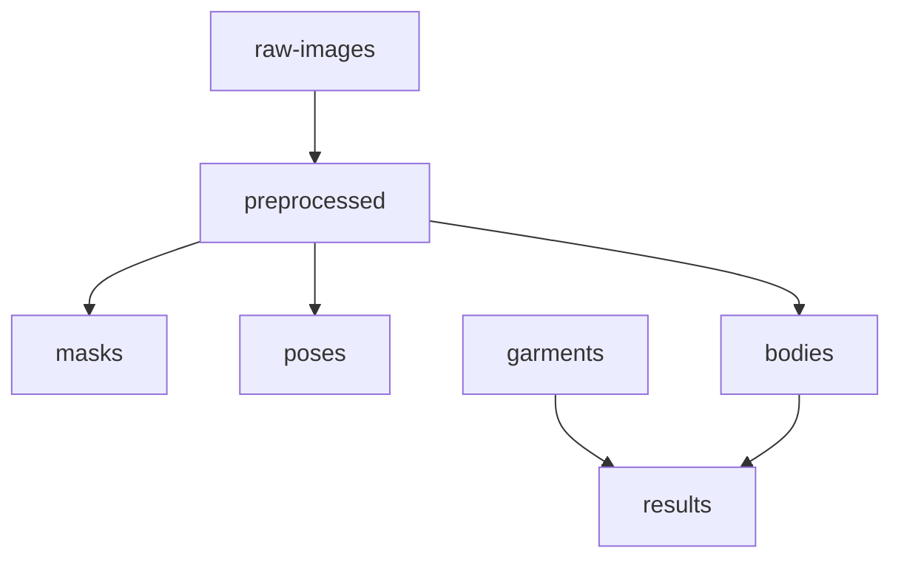

# Object Storage Spec

기준 문서: [../../plan.md](../../plan.md), [../../step.md](../../step.md), [./README.md](./README.md)  
적용 단계: Step 1, Step 8, Step 9

## 1. 문서 목적

### 핵심 목적

- object storage key 규칙 확정
- artifact namespace 구조 확정
- upload / download 정책 기준 제공
- intermediate와 final artifact 경계 정의

## 2. 설계 원칙

### 핵심 원칙

- metadata와 binary 분리
- key는 사람이 추적 가능해야 함
- immutable artifact 우선
- intermediate와 final 분리
- debug artifact 별도 namespace 분리

### 저장 대상

- raw image
- normalized image
- mask
- pose data file
- body mesh
- preview glb
- texture map
- garment asset
- intermediate fitting result
- final glb
- thumbnail
- debug artifacts

## 3. 저장소 구조 개요



## 4. Key Namespace 기준

### 주요 prefix

- `raw-images/`
- `preprocessed/`
- `masks/`
- `poses/`
- `bodies/`
- `garments/`
- `results/`

### 권장 key 템플릿

```text
raw-images/{yyyy}/{mm}/{dd}/{jobId}/original.jpg
preprocessed/{jobId}/normalized.png
masks/{jobId}/person_mask.png
poses/{jobId}/keypoints.json
bodies/{bodyId}/body_canonical.obj
bodies/{bodyId}/body_preview.glb
bodies/{bodyId}/textures/albedo.png
bodies/{bodyId}/textures/normal.png
garments/{garmentId}/source/source.glb
garments/{garmentId}/runtime/garment_runtime.glb
garments/{garmentId}/runtime/thumbnail.jpg
results/{resultId}/intermediate.glb
results/{resultId}/final.glb
results/{resultId}/thumbnail.jpg
results/{resultId}/debug/before_drape.glb
results/{resultId}/debug/collision.json
```

## 5. Prefix별 역할

### raw-images

- 사용자 원본 업로드 이미지
- direct upload 대상
- 짧은 TTL 권장

### preprocessed

- EXIF 정리 및 정규화 결과
- reconstruction 재실행용 중간 산출물

### masks

- segmentation 산출물 저장

### poses

- keypoints 또는 pose metadata 저장

### bodies

- canonical body artifact 저장
- preview glb와 texture map 저장

### garments

- source / runtime asset 저장
- catalog asset의 장기 보관 위치

### results

- fitting intermediate
- final glb
- thumbnail
- debug artifact

## 6. Naming 기준

### 파일명 기준

- 파일명 최소 의미 유지
- key path에서 리소스 의미 구분
- 날짜와 ID는 상위 path에서 관리

### 권장 예시

- `original.jpg`
- `normalized.png`
- `person_mask.png`
- `keypoints.json`
- `body_canonical.obj`
- `body_preview.glb`
- `garment_runtime.glb`
- `intermediate.glb`
- `final.glb`

## 7. Content-Type 기준

| 확장자 | content-type |
|---|---|
| `.jpg` | `image/jpeg` |
| `.png` | `image/png` |
| `.json` | `application/json` |
| `.obj` | `text/plain` 또는 `application/octet-stream` |
| `.glb` | `model/gltf-binary` |

## 8. Upload 정책

### 사용자 direct upload 대상

- `raw-images/*`

### 서버/워커 upload 대상

- `preprocessed/*`
- `masks/*`
- `poses/*`
- `bodies/*`
- `results/*`

### presigned upload 정책

- 짧은 TTL
- 허용 MIME type 제한
- namespace 제한
- 필요 시 size 제한

## 9. Download 정책

### 프론트 직접 접근 대상

- garment thumbnail
- result thumbnail
- final glb

### 내부 처리 전용 대상

- raw-images
- intermediate artifacts
- debug artifacts

### 다운로드 방식

- signed URL 권장
- CDN 앞단 캐시 검토
- debug artifact는 공개 URL 금지

## 10. Immutability 기준

### 권장 정책

- final result overwrite 지양
- intermediate artifact overwrite 지양
- 재생성 시 새 `resultId` 또는 버전 suffix 사용 검토

### overwrite 허용 가능 영역

- 임시 테스트 bucket
- 운영 이전 local/dev 환경

## 11. Bucket 전략

### 초기 권장

- 단일 bucket + prefix 분리

### 추후 고려 가능

- public/private bucket 분리
- raw/private, result/public-like signed access 분리

## 12. Object Storage와 Mongo 관계

### Mongo에 저장할 값

- object key
- URL 아님
- content summary
- artifact 상태

### URL 생성 방식

- API response 생성 시 signed URL 생성
- 또는 CDN path 변환

## 13. 예시 매핑

### Job 기준

```text
job_123
├── raw-images/2026/03/23/job_123/original.jpg
├── preprocessed/job_123/normalized.png
├── masks/job_123/person_mask.png
└── poses/job_123/keypoints.json
```

### Body 기준

```text
body_123
├── bodies/body_123/body_canonical.obj
├── bodies/body_123/body_preview.glb
└── bodies/body_123/textures/albedo.png
```

### Result 기준

```text
result_123
├── results/result_123/intermediate.glb
├── results/result_123/final.glb
├── results/result_123/thumbnail.jpg
└── results/result_123/debug/collision.json
```

## 14. 접근 제어 초안

### public-like signed access

- result final glb
- thumbnails

### private-only access

- raw images
- masks
- pose json
- canonical body obj
- debug artifacts

## 15. Step 1 완료 기준

### 완료 조건

- prefix 체계 확정
- key template 확정
- public/private 접근 기준 확정
- direct upload 대상 확정
- Mongo에 저장할 참조값 형태 확정
