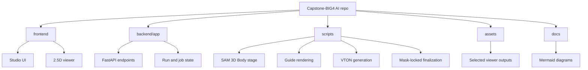
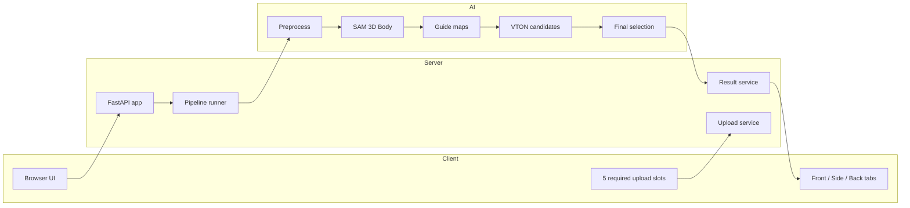
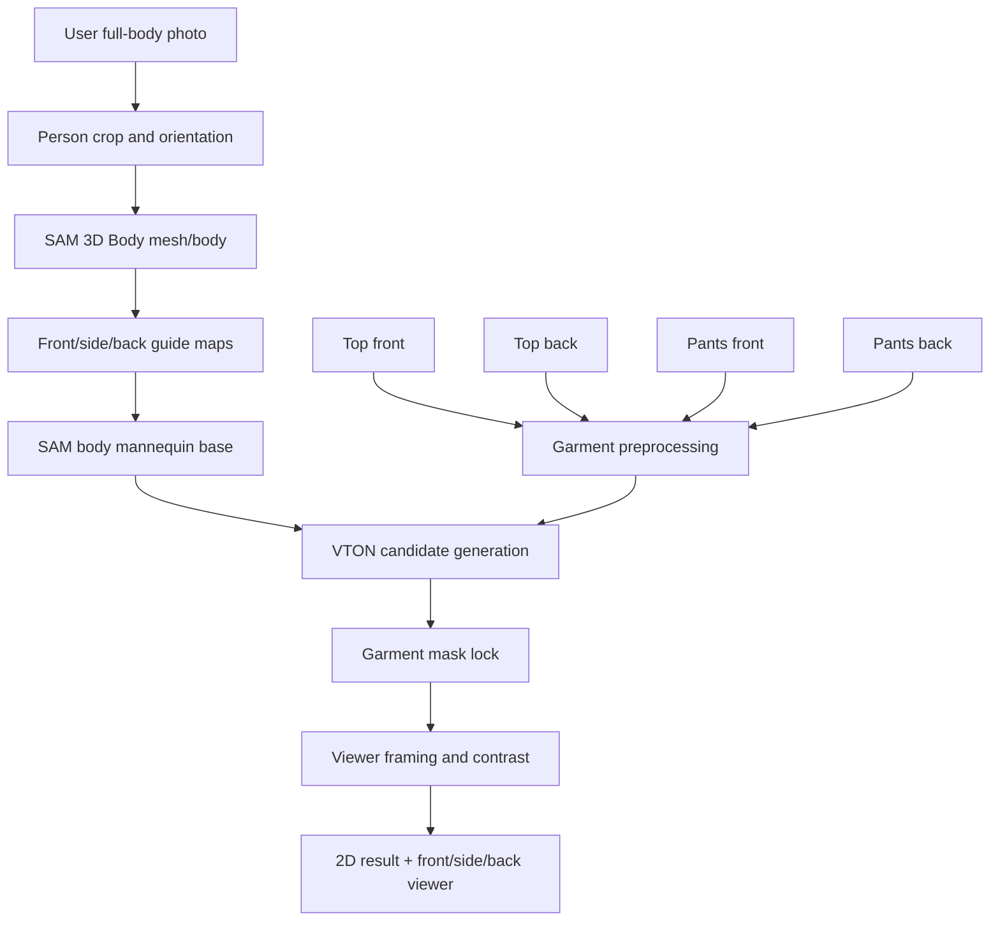
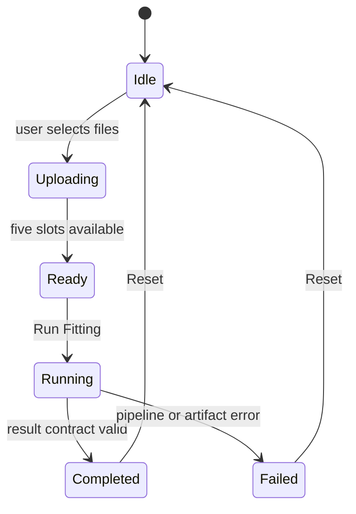
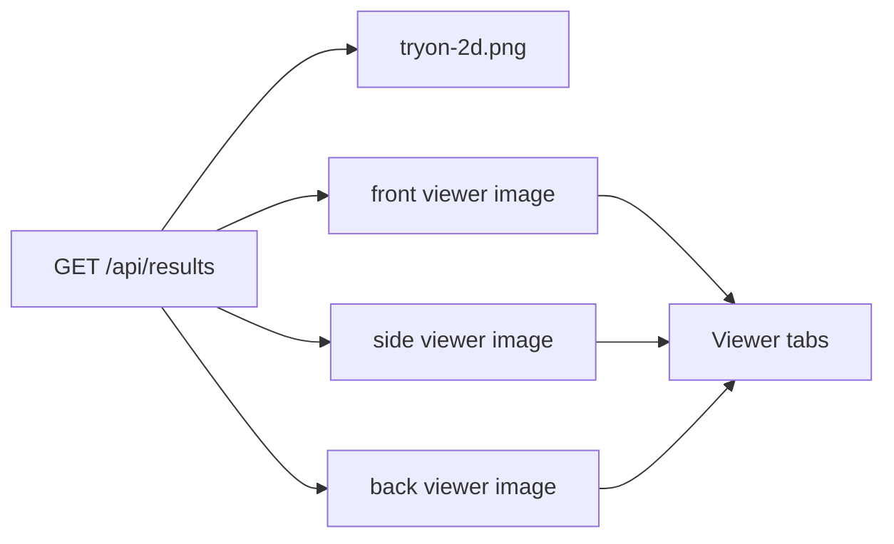

# Architecture

This project uses a pragmatic 2.5D virtual fitting architecture. SAM 3D Body is used to lock the body ratio and pose guide. The garment generation step produces front, side, and back visual outputs instead of a full cloth-simulation mesh.

## Repository Map

## Component Boundaries

## Data Flow

## State Model

## Viewer Contract

