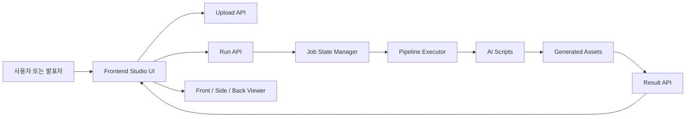
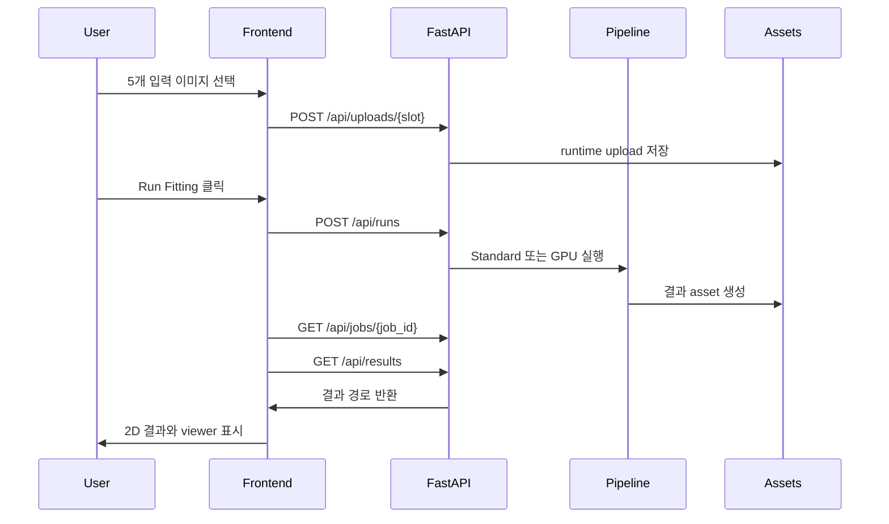

# 개발자 가이드

이 문서는 `Virtual Fitting Studio`의 코드 구조, 실행 흐름, API, AI 파이프라인, 검증 방법을 정리합니다.

## 전체 구조

```text
.
├── frontend/              # 정적 웹 UI
│   ├── index.html
│   ├── src/
│   └── styles/
├── backend/app/           # FastAPI 백엔드
│   ├── api/               # REST endpoint
│   ├── core/              # 경로와 설정
│   ├── pipeline/          # 실행 단계 정의
│   ├── services/          # upload, result, GPU 상태, runner
│   └── state/             # job 상태 저장
├── scripts/               # AI 파이프라인 및 검증 스크립트
├── assets/                # 선택된 결과 이미지와 proof asset
├── docs/                  # 개발/파이프라인 문서
├── requirements.txt
└── Makefile
```

## 시스템 아키텍처



## 데이터 흐름

```mermaid
flowchart TD
  Person[사용자 전신 사진]
  TopFront[상의 앞]
  TopBack[상의 뒤]
  PantsFront[하의 앞]
  PantsBack[하의 뒤]

  Person --> Preprocess[이미지 정렬과 전처리]
  Preprocess --> Body[SAM 3D Body]
  Body --> Guides[Front / Side / Back Guide Map]

  TopFront --> GarmentPrep[의류 전처리]
  TopBack --> GarmentPrep
  PantsFront --> GarmentPrep
  PantsBack --> GarmentPrep

  Guides --> Base[SAM Body Mannequin Base]
  Base --> VTON[VTON Candidate Generation]
  GarmentPrep --> VTON
  VTON --> Finalize[Mask-Locked Finalization]
  Finalize --> Viewer[2D Result + 2.5D Viewer Output]
```



## 실행 시퀀스



## 프론트엔드

프론트엔드는 별도 빌드 과정이 없는 정적 HTML/CSS/JavaScript입니다.

- `frontend/index.html`: 화면 레이아웃
- `frontend/src/app/bootstrap.js`: 이벤트 바인딩과 라우팅
- `frontend/src/features/fitting/session.js`: 실행 세션 처리
- `frontend/src/components/uploads.js`: 5개 입력 슬롯
- `frontend/src/components/viewer.js`: front / side / back viewer
- `frontend/src/components/pipeline.js`: Analytics 진행 단계
- `frontend/src/config/assets.js`: UI에서 참조하는 결과 asset 경로

## 백엔드

백엔드는 FastAPI로 구성됩니다.

주요 endpoint:

```text
GET  /api/health
GET  /api/results
POST /api/uploads/{slot}
POST /api/runs
GET  /api/jobs/{job_id}
```

주요 모듈:

- `backend/app/main.py`: 앱 생성, 정적 파일 mount
- `backend/app/services/uploads.py`: 업로드 저장
- `backend/app/services/results.py`: 결과 경로 반환
- `backend/app/services/pipeline_runner.py`: 실행 모드별 job 시작
- `backend/app/pipeline/steps.py`: GPU pipeline command 정의
- `backend/app/pipeline/executor.py`: 단계 실행과 progress 업데이트

## AI 파이프라인

주요 스크립트:

```text
scripts/01_preprocess_assets.py
scripts/02_run_sam3d_body.py
scripts/02b_export_sam3d_body_artifact.py
scripts/03_render_guides.py
scripts/04_prepare_garments.py
scripts/18_build_sam_body_only_mannequin_base.py
scripts/19_generate_sam_body_only_fashn_viewer.py
scripts/20_select_sam_body_only_viewer.py
scripts/10_guard_viewer_contract.py
```

핵심 흐름:

1. 사용자 사진과 의류 이미지를 전처리합니다.
2. SAM 3D Body로 신체 구조를 추정합니다.
3. front / side / back guide map을 생성합니다.
4. SAM body 기반 마네킹 base를 생성합니다.
5. VTON 후보를 생성합니다.
6. 상의/하의 mask 영역만 고정 합성하여 최종 viewer 이미지를 만듭니다.
7. viewer contract를 검증합니다.

## 결과 Contract

UI와 API는 아래 결과 경로를 기준으로 동작합니다.

```text
assets/results/tryon-2d.png
assets/results/display/sam-body-only-front-contrast.png
assets/results/display/sam-body-only-side-contrast.png
assets/results/display/sam-body-only-back-contrast.png
```

`assets/manifest.json`은 공개 repo에서 사용하는 결과와 proof asset 경로를 기록합니다.

## 개발 실행

```bash
python scripts/dev/run_server.py --port 8000
```

`Makefile`을 사용할 수도 있습니다.

```bash
make dev
```

conda 환경을 지정하려면:

```bash
make dev PYTHON="conda run -n bys python"
```

## 검증

```bash
make check PYTHON="conda run -n bys python"
python scripts/10_guard_viewer_contract.py
```

FastAPI 앱만 빠르게 확인하려면:

```bash
python -c "from fastapi.testclient import TestClient; from backend.app.main import app; c=TestClient(app); assert c.get('/api/results').json()['ready'] is True; print('ok')"
```

## 개발 규칙

- `.env`는 commit하지 않습니다.
- 대용량 모델 파일은 repo에 넣지 않습니다.
- SAM 3D Body 소스는 `external/sam-3d-body` 또는 `SAM3D_BODY_DIR`로 연결합니다.
- FASHN VTON 가중치는 `external/fashn-vton-1.5/weights` 또는 `FASHN_WEIGHTS_DIR`로 연결합니다.
- front / side / back viewer 경로를 바꿀 때는 `scripts/10_guard_viewer_contract.py`를 반드시 통과시킵니다.
- 공개 문서에는 실시간 성능을 과장하지 않고, 현재 구현 범위를 명확히 적습니다.
