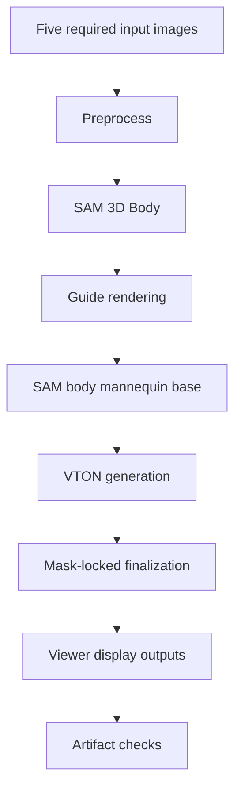

# Technical Pipeline

The implementation target is a high-quality front, side, and back mannequin fitting view. The pipeline is designed around SAM-guided body consistency rather than free-form image editing.

## Inputs

The studio requires five images:

1. User full-body photo
2. Top garment front
3. Top garment back
4. Pants garment front
5. Pants garment back

## Pipeline Stages

### 1. Preprocess Assets

The input person image is oriented, cropped, and prepared for body analysis. Garment images are normalized into transparent cutout-style inputs where possible.

### 2. SAM 3D Body

SAM 3D Body estimates the body mesh and body measurements from the user photo. This stage provides the body proportion anchor for later front, side, and back generation.

The implementation expects the official SAM 3D Body source to be available at `external/sam-3d-body` or at the path configured by `SAM3D_BODY_DIR`.

### 3. Guide Rendering

The body artifact is rendered into view-specific guide maps:

- front silhouette
- front depth
- front normal
- side normal
- back normal

These guide maps prevent the fitting stage from drifting away from the target body structure.

### 4. SAM Body Mannequin Base

The generated mannequin base is built from the SAM-derived body shape and guide masks. This base is intentionally neutral so garment pixels can be composed without changing body identity into a different reference mannequin.

### 5. VTON Candidate Generation

The VTON stage generates outfit candidates from the garment front/back images and the SAM body base. The front and back views use mask-locked shirt and pants regions to preserve body boundaries. The side view is generated as a side-facing mannequin result.

### 6. Finalization

The finalization step keeps the mannequin body outside the garment masks and applies garment pixels only inside selected shirt and pants regions. The final display pass adjusts framing and contrast for the 3D viewer.

## Verification Contract

The repo verifies:

- required frontend and backend files exist
- selected viewer images exist and have valid dimensions
- `assets/manifest.json` references only present local files
- local secrets are not embedded into public artifacts
- the viewer result contract points to the expected front, side, and back images

## Mermaid Summary

## Known Scope

This is a capstone demo pipeline focused on a high-quality fixed outfit and body sample. It is not presented as a universal fitting engine for every pose, body shape, garment fabric, or lighting condition.
