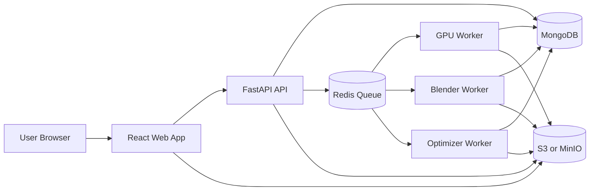
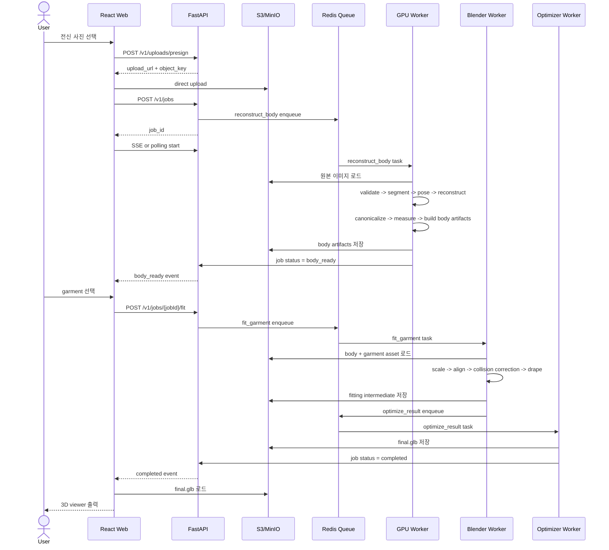
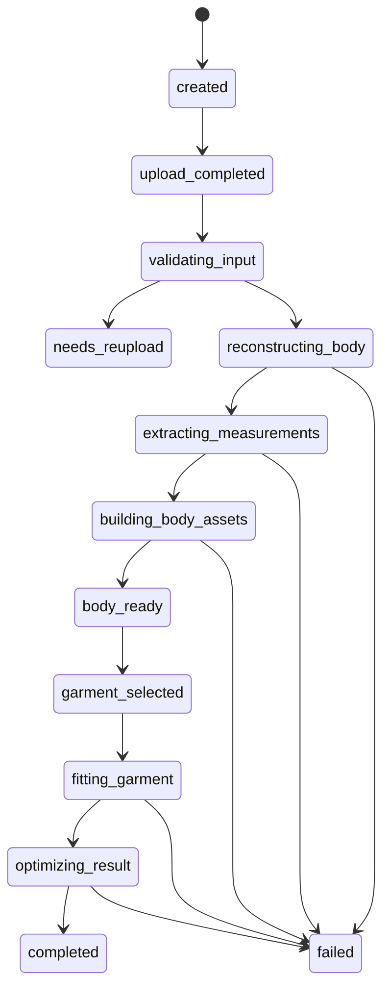

# 3D Body-Based Virtual Fitting System Plan

작성일: 2026-03-29  
대상: 단일 전신 사진 기반 3D body reconstruction + 3D garment virtual fitting + 웹 360도 결과 렌더링

## 1. 문서 목적

이 문서의 목적은 `body-only` 기준 가상 피팅 시스템의 전체 구조를 실제 구현 가능한 수준으로 재정의하는 작업이다.

핵심 목적:

- 사용자 전신 사진 1장 입력 기준 서비스 범위 명확화
- frontend / backend / AI / 3D fitting 경계 정리
- long-running pipeline의 비동기 job 구조 정리
- canonical body 중심 데이터 구조 정리
- garment asset 표준화 기준 정리
- 이후 구현 단계의 우선순위와 의존성 정리

이 문서에서의 중요한 전제:

- 목표는 photoreal digital human 생성 아님
- 목표는 얼굴 복원 아님
- 목표는 사용자의 체형에 가까운 `canonical body` 생성과 그 위의 garment fitting

## 2. 제품 정의

### 2.1 최종 목표

사용자가 전신 사진 1장을 업로드하고, 준비된 garment catalog에서 의류를 선택하면, 서버가 body reconstruction과 garment fitting을 수행하고, 최종 `.glb` 결과를 브라우저에서 360도로 확인할 수 있는 시스템 목표

### 2.2 사용자 가치

- 온라인 쇼핑에서 체형 기반 시각적 핏 확인 가능성
- 평균 마네킹이 아닌 사용자 body silhouette 기준 결과 확인 가능성
- 별도 설치 없이 웹 기반 접근 가능성
- garment asset과 fitting rule을 재사용할 수 있는 확장 구조 확보

### 2.3 MVP 범위

- 입력: 정면 전신 사진 1장
- 대상: 성인 1명, 단독 피사체
- 배경: 단순 배경 권장
- 포즈: 정적 neutral pose 권장
- 지원 카테고리: `top`, `bottom`, `outer`, `dress`
- 출력: `body + garment` 결합 결과 `.glb`
- 처리 시간 목표: 20~60초
- 결과 성격: 실제 신체의 완전 복원 아님, fitting을 위한 canonical body 기반 시뮬레이션 결과

### 2.4 초기 비범위

- 얼굴, 머리카락, 손가락의 고정밀 복원
- 실시간 webcam fitting
- 다중 인물 처리
- 극단적 포즈, 앉은 자세, 거울 셀피 중심 입력
- 임의 2D 의류 이미지를 즉시 3D garment로 자동 변환
- 정확한 사이즈 추천 보장
- 물리 시뮬레이션 기반 최고품질 cloth solver

## 3. 핵심 문제 정의

이 프로젝트의 본질은 `사진에서 body를 뽑는 문제`와 `그 body 위에 garment를 안정적으로 입히는 문제`의 결합이다.

핵심 문제:

1. 단일 사진에서 안정적인 canonical body 생성 필요
2. loose clothing, 카메라 원근, 가림에 따른 body proportion 왜곡 문제
3. garment texture, garment length, fit metadata를 runtime에서 body와 결합해야 하는 문제
4. GPU 추론, Blender fitting, web rendering이 모두 다른 스택이라는 점
5. 사용자 요청 수명보다 훨씬 긴 연산 시간을 비동기 구조로 처리해야 하는 점

## 4. 핵심 설계 원칙

### 4.1 Canonical Body 우선

가장 중요한 산출물은 예쁜 최종 mesh가 아니라 fitting 기준이 되는 canonical body다.

canonical body 필수 속성:

- 단위: meter
- 기준 포즈: A-pose 또는 T-pose
- 기준 원점: pelvis center
- 정면 방향 일관성
- skeleton naming 일관성
- measurement extraction 가능 구조

### 4.2 Body와 Garment의 역할 분리

`SAM 3D Body`는 body reconstruction 역할만 담당한다.  
garment의 길이, 품, 재질, texture, normal, roughness는 별도 garment asset과 fitting rule이 담당한다.

역할 분리:

- Body layer: body mesh, keypoints, body params, measurements
- Garment layer: garment mesh, materials, size metadata, category rule
- Fitting layer: scaling, alignment, collision correction, drape

### 4.3 Long Job 비동기 구조

모든 장시간 작업은 HTTP 단건 요청으로 처리하지 않는다.

필수 구조:

- API server: orchestration
- Redis queue: task dispatch
- GPU worker: reconstruction
- Blender worker: fitting
- Optimizer worker: delivery artifact 생성

### 4.4 Intermediate Artifact 저장

중간 산출물을 저장하지 않으면 품질 비교와 디버깅이 어렵다.

필수 intermediate artifact:

- original upload
- normalized image
- person mask
- keypoints json
- body params json
- canonical body mesh
- measurements json
- fitting intermediate glb
- final glb

### 4.5 Garment Standardization 선행

런타임에 아무 3D 의류나 바로 입히는 구조는 실패 확률이 높다.

garment 사전 정규화 기준:

- 단위와 축 정리
- 기준 pose 정리
- category 태깅
- base size 정의
- material slot 정리
- anchor 또는 rig 기준 정리
- fit metadata 입력

## 5. 권장 기술 스택

### 5.1 Frontend

- React + TypeScript
- Vite
- React Query
- Zustand
- React Three Fiber
- Three.js
- `@react-three/drei`
- Axios 또는 Fetch API

### 5.2 Backend

- FastAPI
- Pydantic v2
- Redis
- MongoDB
- S3 또는 MinIO
- Uvicorn / Gunicorn
- Celery 또는 Dramatiq

### 5.3 AI / 3D

- PyTorch
- `SAM 3D Body`
- OpenCV / Pillow
- `numpy`, `scipy`, `trimesh`
- Blender headless + Python API
- `gltf-transform`, `gltfpack`, `meshopt`, `Draco`, `KTX2`

### 5.4 운영

- Docker Compose
- Nginx
- Prometheus + Grafana
- Sentry

## 6. 시스템 논리 아키텍처



컴포넌트별 책임:

- Web App: upload, status, garment selection, viewer
- API: auth, job 생성, status 조회, metadata 반환
- GPU Worker: body reconstruction, measurements
- Blender Worker: garment fitting
- Optimizer Worker: final glb 최적화
- MongoDB: 상태와 metadata
- Object Storage: 원본과 중간/최종 binary artifact

## 7. 저장소 구조

```text
/frontend
  /web
  /docs
/backend
  /api
  /docs
/ai
  /workers
    /gpu-worker
    /blender-worker
    /optimizer-worker
  /docs
  /scripts
  /third_party
  /checkpoints
/assets
  /garments
  /hdri
/infra
  /docker
  /nginx
  /monitoring
/packages
  /shared-config
  /shared-types
/plan.md
```

## 8. End-to-End Runtime Flow

### 8.1 사전 조건

사용자가 garment를 선택하기 전에 garment asset은 이미 아래 기준 충족 상태여야 한다.

- `.glb` 또는 master `fbx` 준비 상태
- base size metadata 입력 상태
- category, length class, fit class 정리 상태
- material maps 연결 상태
- body 기준 anchor / rig alignment 준비 상태

### 8.2 사용자 흐름

1. 사용자 웹 접속
2. 전신 사진 업로드
3. API가 presigned upload URL 발급
4. 브라우저가 object storage에 직접 업로드
5. API가 reconstruction job 생성
6. GPU worker가 body reconstruction 수행
7. 결과 상태가 `body_ready`로 전이
8. 사용자가 garment 선택
9. API가 fitting job enqueue
10. Blender worker가 garment fitting 수행
11. Optimizer worker가 `.glb` 최적화
12. API가 completed 상태 갱신
13. frontend가 최종 `.glb` 로드
14. 사용자가 360도 결과 확인

### 8.3 런타임 시퀀스



## 9. Job 상태 머신

### 9.1 상태 정의

| 상태 | 의미 | 소유 컴포넌트 |
|---|---|---|
| `created` | job metadata만 생성된 상태 | API |
| `upload_completed` | 원본 업로드 완료 상태 | API |
| `validating_input` | 입력 품질 검증 단계 | GPU Worker |
| `reconstructing_body` | body reconstruction 단계 | GPU Worker |
| `extracting_measurements` | measurement 산출 단계 | GPU Worker |
| `building_body_assets` | canonical body artifact 생성 단계 | GPU Worker |
| `body_ready` | fitting 가능한 body artifact 준비 상태 | GPU Worker |
| `garment_selected` | garment 선택 완료 상태 | API |
| `fitting_garment` | body + garment fitting 단계 | Blender Worker |
| `optimizing_result` | final glb 최적화 단계 | Optimizer Worker |
| `completed` | 결과 사용 가능 상태 | Optimizer Worker |
| `needs_reupload` | 입력 품질 문제로 재업로드 필요 상태 | GPU Worker |
| `failed` | 시스템 또는 처리 실패 상태 | Worker/API |

### 9.2 상태 전이



## 10. Frontend 설계

### 10.1 핵심 화면

- Landing / Upload page
- Processing page
- Garment selection page
- Result viewer page

### 10.2 주요 책임

- 촬영 가이드 표시
- presigned upload 수행
- job 생성 요청
- SSE 또는 polling으로 상태 갱신
- `body_ready` 이후 garment catalog 노출
- final `.glb` viewer 렌더링

### 10.3 프론트엔드 상태 분리

- upload state
- job state
- garment selection state
- viewer state
- error state

### 10.4 viewer 요구사항

- OrbitControls
- HDRI 또는 stage light
- mobile fallback
- loading / retry UI
- glb source 교체 가능 구조

## 11. Backend API 설계

### 11.1 핵심 엔드포인트

| Method | Path | 목적 |
|---|---|---|
| `POST` | `/v1/uploads/presign` | direct upload URL 발급 |
| `POST` | `/v1/jobs` | body reconstruction job 생성 |
| `GET` | `/v1/jobs/{jobId}` | job 상태 조회 |
| `GET` | `/v1/jobs/{jobId}/events` | SSE 또는 event stream |
| `GET` | `/v1/garments` | garment catalog 조회 |
| `POST` | `/v1/jobs/{jobId}/fit` | fitting 시작 |
| `GET` | `/v1/results/{resultId}` | 최종 결과 metadata 조회 |
| `GET` | `/v1/health` | healthcheck |

### 11.2 API 책임

- 업로드 의도 생성
- job 생성과 상태 전이 기록
- worker task enqueue
- 결과 metadata 응답
- 인증/인가와 rate limit

### 11.3 API 비목표

- heavy binary relay
- GPU 추론 직접 수행
- Blender fitting 직접 수행

## 12. 데이터 구조

### 12.1 컬렉션

- `users`
- `jobs`
- `bodies`
- `garments`
- `results`
- `job_events`

### 12.2 jobs 예시

```json
{
  "_id": "job_123",
  "user_id": "user_001",
  "status": "body_ready",
  "upload_object_key": "uploads/raw/user_001/job_123/original.jpg",
  "body_id": "body_123",
  "selected_garment_id": null,
  "result_id": null,
  "created_at": "2026-03-29T09:00:00Z",
  "updated_at": "2026-03-29T09:00:28Z"
}
```

### 12.3 bodies 예시

```json
{
  "_id": "body_123",
  "job_id": "job_123",
  "user_id": "user_001",
  "mesh_object_key": "bodies/body_123/body_canonical.obj",
  "preview_glb_key": "bodies/body_123/body_preview.glb",
  "measurements_key": "bodies/body_123/measurements.json",
  "body_params_key": "bodies/body_123/body_params.json",
  "quality_scores": {
    "segmentation_score": 0.91,
    "reconstruction_score": 0.86,
    "measurement_reliability": 0.79
  },
  "created_at": "2026-03-29T09:00:28Z"
}
```

### 12.4 results 예시

```json
{
  "_id": "result_123",
  "job_id": "job_123",
  "body_id": "body_123",
  "garment_id": "garment_top_001",
  "final_glb_key": "results/result_123/final.glb",
  "thumbnail_key": "results/result_123/thumbnail.png",
  "fit_summary": {
    "category": "top",
    "fit_class": "regular",
    "length_class": "standard"
  },
  "created_at": "2026-03-29T09:00:46Z"
}
```

### 12.5 Object Storage Key 구조

```text
uploads/raw/{userId}/{jobId}/original.jpg
uploads/normalized/{jobId}/normalized.png
reports/{jobId}/validation.json
reports/{jobId}/timings.json

bodies/{bodyId}/body_canonical.obj
bodies/{bodyId}/body_preview.glb
bodies/{bodyId}/measurements.json
bodies/{bodyId}/body_params.json
bodies/{bodyId}/textures/albedo.png

garments/{garmentId}/runtime.glb
garments/{garmentId}/materials/baseColor.png
garments/{garmentId}/metadata.json

results/{resultId}/intermediate.glb
results/{resultId}/final.glb
results/{resultId}/thumbnail.png
```

## 13. AI Body Reconstruction 설계

### 13.1 입력 정책

- full-body visibility 우선
- neutral frontal pose 우선
- background simplicity 우선
- low blur, sufficient lighting 우선

### 13.2 처리 단계

1. input validation
2. person segmentation
3. pose / keypoint estimation
4. body reconstruction
5. canonical pose normalization
6. measurement extraction
7. preview artifact 생성

### 13.3 출력물

- person mask
- keypoints json
- body params json
- canonical body mesh
- measurements json
- quality score

### 13.4 품질 평가 기준

- segmentation confidence
- pose confidence
- reconstruction score
- measurement reliability
- warning flag

## 14. Garment Asset 설계

### 14.1 garment asset 필수 구성

- runtime `.glb`
- master source `fbx` 또는 authoring file
- category
- size metadata
- material maps
- fit metadata

### 14.2 garment metadata 예시

- `category`
- `base_size`
- `fit_class`
- `length_class`
- `supported_body_region`
- `material_profile`
- `stretch_profile`
- `collision_margin`

### 14.3 길이와 질감 처리 원칙

길이와 질감은 body reconstruction 결과에서 생성하지 않는다.  
길이는 garment metadata와 geometry variation으로 처리하고, 질감은 garment material map과 viewer material pipeline으로 처리한다.

즉:

- 상의 길이: crop / standard / long
- 소매 길이: sleeveless / short / long
- 하의 길이: short / ankle / full
- 재질: cotton / knit / denim / nylon 등 preset

## 15. Virtual Fitting Engine 설계

### 15.1 fitting 단계

1. body artifact 로드
2. garment runtime asset 로드
3. category별 기준 measurement 비교
4. base scale 계산
5. anchor 또는 rig alignment
6. collision correction
7. optional fast drape
8. intermediate glb export

### 15.2 카테고리별 주요 measurement

- top: shoulder, chest, torso length, sleeve length
- bottom: waist, hip, thigh, inseam
- outer: shoulder, chest, sleeve length, hem clearance
- dress: chest, waist, hip, total length

### 15.3 fitting 수준 분리

- Fast Fit: scaling + alignment + shrinkwrap correction
- Quality Fit: fast fit + collision refinement + material-specific tuning

## 16. Optimizer / Viewer 설계

### 16.1 optimizer 역할

- mesh cleanup
- glb export normalize
- texture compression
- thumbnail render
- delivery artifact 준비

### 16.2 viewer 요구사항

- `GLTFLoader`
- orbit control
- PBR material
- stage lighting
- mobile performance fallback
- load error fallback

## 17. 운영, 보안, QA

### 17.1 보안

- 원본 이미지 단기 보존 정책
- private object storage 기본 정책
- presigned URL 만료 시간 제한
- PII 최소 저장 원칙

### 17.2 관측성

- job 상태 전이 로그
- worker latency
- GPU memory 사용량
- failure code 집계
- retry 횟수 추적

### 17.3 QA

- benchmark input set 유지
- good / warning / reject 라벨 유지
- regression smoke test
- body mesh artifact sanity check
- garment fitting visual QA

## 18. 성능 목표

### 18.1 목표 지표

- body reconstruction: 10~30초
- sample garment fast fit: 5~20초
- final optimize: 3~10초
- total end-to-end: 20~60초

### 18.2 우선순위

- first: correctness
- second: repeatability
- third: latency

## 19. 구현 우선순위

1. Step 0~3: body reconstruction 안정화
2. Step 4: canonical body + measurements
3. Step 5~6: sample garment 1종 fast fit
4. Step 7: viewer delivery artifact
5. Step 8~10: backend/frontend end-to-end
6. Step 11 이후: category 확장과 품질 개선

## 20. 핵심 리스크

### 20.1 body proportion 오차

- loose clothing
- camera perspective
- occlusion

대응:

- strict input guide
- quality score
- reupload policy

### 20.2 garment asset 품질 편차

- topology 불일치
- metadata 누락
- material map 불완전

대응:

- asset spec 강제
- ingest QA checklist

### 20.3 fitting 안정성

- penetration
- overstretch
- pose mismatch

대응:

- category별 rule
- fast fit / quality fit 분리

## 21. 결론

이 프로젝트의 중심은 `사용자처럼 보이는 디지털 휴먼`이 아니라 `사용자 체형에 가까운 canonical body를 기반으로 한 virtual fitting`이다.

성공 조건:

- body reconstruction 안정성
- garment asset 표준화
- fitting pipeline repeatability
- frontend와 backend의 비동기 orchestration 완성

이 기준이 확보되면 얼굴 복원 없이도 충분히 의미 있는 3D virtual fitting demo와 확장 가능한 서비스 골격 확보 가능
