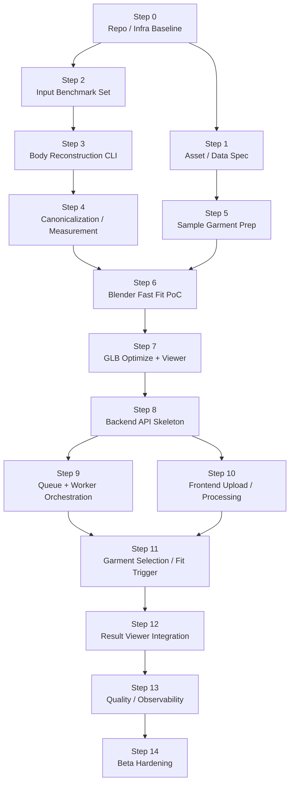

# Virtual Fitting Execution Steps

기준 문서: [plan.md](./plan.md), [README.md](./README.md), [plan.docs](./plan.docs)

## 1. 문서 목적

이 문서는 body-only virtual fitting 시스템을 실제 구현 단계로 분해한 실행 기준 문서다.

핵심 목적:

- 설계 문서를 작업 단위로 분해
- 선행 조건과 후행 조건 명확화
- 현재 완료 범위와 미완료 범위 구분
- 팀 단위 작업 분배 기준 제공
- git 업로드 이후 다음 개발 순서 고정

## 2. 현재 방향

핵심 방향:

- 얼굴 복원 제외
- canonical body 확보 우선
- garment asset 표준화 우선
- fast fit 우선
- backend와 frontend는 AI 산출물 contract 기준으로 연결

프로젝트 성공 조건:

1. 단일 사진에서 usable canonical body 생성
2. sample garment 1종을 body 위에 안정적으로 fitting
3. 결과 `.glb`를 web viewer에서 안정적으로 로드

## 3. 현재 상태 요약

| Step | 이름 | 현재 상태 |
|---|---|---|
| 0 | Repo / Infra Baseline | 완료 |
| 1 | Asset / Data Spec | 완료 |
| 2 | Input Benchmark Set | 완료 |
| 3 | Body Reconstruction CLI | 완료 |
| 4 | Canonicalization / Measurement | 다음 핵심 작업 |
| 5 | Sample Garment Prep | 대기 |
| 6 | Blender Fast Fit PoC | 대기 |
| 7 | GLB Optimize + Viewer | 부분 진행 |
| 8 | Backend API Skeleton | 부분 진행 |
| 9 | Queue + Worker Orchestration | 미진행 |
| 10 | Frontend Upload / Processing | 미진행 |
| 11 | Garment Selection / Fit Trigger | 미진행 |
| 12 | Result Viewer Integration | 부분 진행 |
| 13 | Quality / Observability | 미진행 |
| 14 | Beta Hardening | 미진행 |

## 4. 실행 원칙

### 원칙 1

가장 큰 불확실성부터 제거 우선

- body reconstruction
- measurement reliability
- garment fitting stability

### 원칙 2

중간 산출물 저장 우선

필수 artifact:

- normalized image
- person mask
- keypoints json
- body params json
- canonical body mesh
- measurements json
- fitting intermediate glb
- final glb

### 원칙 3

각 단계 종료 시점의 데모 확보 우선

- CLI demo
- local API demo
- browser demo
- benchmark report

### 원칙 4

body와 garment를 분리 설계

- body reconstruction 결과에 garment 질감이나 길이를 직접 넣지 않음
- garment length / fit / material은 garment metadata에서 관리

## 5. 의존성 맵

## 6. 단계별 상세

### Step 0. Repo / Infra Baseline

상태: 완료

목표:

- 도메인별 폴더 구조 정리
- local infra baseline 구성
- 기본 실행 환경 정리

완료 범위:

- `frontend / backend / ai` 구조 분리
- `.env.example`, `.gitignore`, `Makefile` 정리
- Redis / Mongo / MinIO compose baseline
- FastAPI skeleton
- React / Vite skeleton

남은 검토:

- docker compose 운영 시나리오 보강
- GPU / Blender worker startup script 정리

### Step 1. Asset / Data Spec

상태: 완료

목표:

- garment asset 규격 확정
- object key 구조 확정
- Mongo schema 초안 확정

완료 범위:

- garment asset spec
- object storage spec
- mongo schema draft
- artifact lifecycle draft

남은 검토:

- `bodies` 기준 naming 통일
- garment metadata 최소 필드 재검증

### Step 2. Input Benchmark Set

상태: 완료

목표:

- 입력 품질 평가 기준 고정
- fail / warning 사례 조기 수집
- reconstruction benchmark 템플릿 준비

완료 범위:

- benchmark manifest template
- review checklist
- labeling guide
- reconstruction benchmark template

남은 검토:

- `head_visibility` 등 legacy 필드 정리
- 실제 benchmark 샘플셋 수집

### Step 3. Body Reconstruction CLI

상태: 완료

목표:

- 단일 이미지에서 body reconstruction artifact 생성 가능 상태 확보

완료 범위:

- GPU worker CLI
- manifest batch run
- mock provider
- real `SAM 3D Body` provider 연결
- smoke test
- output artifact 구조 생성

현재 확보 산출물:

- normalized image
- person mask
- keypoints json
- body params json
- raw mesh obj
- timings / summary json

Step 3 완료 기준 충족 여부:

- `SAM 3D Body` real inference 가능 상태
- sample image 기준 결과 확인 가능 상태
- web OBJ viewer 연결 가능 상태

### Step 4. Canonicalization / Measurement

상태: 다음 핵심 작업

목표:

- fitting 기준 canonical body 고정
- measurement extraction 규칙 확정

핵심 작업:

- mesh orientation / origin / scale 고정
- body coordinate normalization
- measurement extraction 함수 정의
- measurements json schema 작성
- reliability score 정의

산출물:

- canonical body export
- measurements json
- body preview glb
- measurement validation report

완료 기준:

- garment fitting이 측정값을 바로 참조 가능 상태
- sample 5장 기준 measurement 편차 점검 가능 상태

### Step 5. Sample Garment Prep

상태: 대기

목표:

- 샘플 garment 1~3종 정규화

우선 garment:

- short sleeve top 1종
- pants 1종 또는 dress 1종

핵심 작업:

- unit / axis 정리
- base size 정의
- category / fit / length metadata 입력
- material slot 정리
- runtime `.glb` 생성

완료 기준:

- body fitting 입력으로 바로 쓸 수 있는 garment asset 확보 상태

### Step 6. Blender Fast Fit PoC

상태: 대기

목표:

- body + garment 결합 가능성 검증

핵심 작업:

- body mesh import
- garment import
- category별 anchor alignment
- measurement 기반 scale 적용
- shrinkwrap / collision correction
- intermediate glb export

완료 기준:

- sample body 3건에서 visibly broken 결과 없이 garment 장착 가능 상태

### Step 7. GLB Optimize + Viewer

상태: 부분 진행

현재 확보 범위:

- OBJ viewer 구현

남은 범위:

- OBJ -> GLB conversion path
- texture / mesh optimization
- final result loader

완료 기준:

- `.glb` 기준 browser viewer 안정 로드
- stage light와 orbit control 기준 데모 가능 상태

### Step 8. Backend API Skeleton

상태: 부분 진행

현재 확보 범위:

- FastAPI skeleton
- healthcheck endpoint

남은 범위:

- presign endpoint
- create job endpoint
- get job endpoint
- fit trigger endpoint
- result metadata endpoint

완료 기준:

- frontend에서 job lifecycle 호출 가능한 최소 contract 확보 상태

### Step 9. Queue + Worker Orchestration

상태: 미진행

목표:

- API와 worker 연결

핵심 작업:

- queue payload schema
- worker task registration
- job event 기록
- retry / timeout 정책
- state transition validation

완료 기준:

- create job -> body_ready 자동 전이
- fit job -> completed 자동 전이

### Step 10. Frontend Upload / Processing

상태: 미진행

목표:

- body reconstruction 시작 전 사용자 입력 흐름 완성

핵심 작업:

- 촬영 가이드 UI
- presigned upload
- progress state UI
- SSE 또는 polling 연결
- reject / reupload 분기 UI

완료 기준:

- 사용자가 사진 업로드 후 `body_ready`까지 진행 상황 확인 가능 상태

### Step 11. Garment Selection / Fit Trigger

상태: 미진행

목표:

- `body_ready` 이후 garment 선택과 fitting 요청 연결

핵심 작업:

- garment catalog fetch
- category filter
- selection state
- fit trigger action

완료 기준:

- `body_ready` 상태에서 garment 선택 후 fitting job 시작 가능 상태

### Step 12. Result Viewer Integration

상태: 부분 진행

현재 확보 범위:

- raw OBJ viewer

남은 범위:

- final GLB loader
- result metadata panel
- garment info panel
- retry / fallback UI

완료 기준:

- 최종 fitted result를 브라우저에서 360도로 확인 가능 상태

### Step 13. Quality / Observability

상태: 미진행

목표:

- 운영 가능한 최소 관측성 확보

핵심 작업:

- structured logs
- failure code taxonomy
- latency dashboard
- benchmark regression 체크
- artifact cleanup 정책

### Step 14. Beta Hardening

상태: 미진행

목표:

- category 확장
- fit quality 안정화
- 사용자 흐름 polish

핵심 작업:

- garment category 확대
- measurement calibration
- viewer UX polish
- admin/debug tooling

## 7. 현재 바로 필요한 작업

우선순위:

1. Step 4 시작
2. Step 5 병행 준비
3. Step 6 PoC 진입

이유:

- body reconstruction은 이미 동작 상태
- 이제 실제 가상 피팅이 되려면 canonical body와 measurements가 먼저 필요
- garment asset이 없으면 fitting worker 작업 착수 불가

## 8. 체크포인트 기준

### Gate A

조건:

- Step 4 완료

의미:

- body reconstruction 결과를 fitting 입력으로 신뢰 가능 상태

### Gate B

조건:

- Step 6 완료

의미:

- sample garment 1종 기준 가상 피팅 가능성 검증 완료 상태

### Gate C

조건:

- Step 12 완료

의미:

- end-to-end virtual fitting demo 가능 상태

## 9. 결론

현재 저장소의 다음 핵심 과제는 얼굴 개인화가 아니라 `canonical body 정리`와 `sample garment fitting`이다.

따라서 다음 개발 순서는 아래 기준 유지 필요:

- Step 4 먼저
- Step 5 병행
- Step 6으로 가상 피팅 가능성 검증
- 이후 backend / frontend 통합
